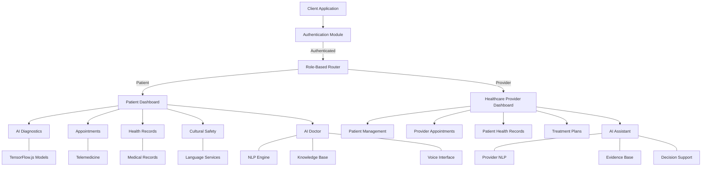
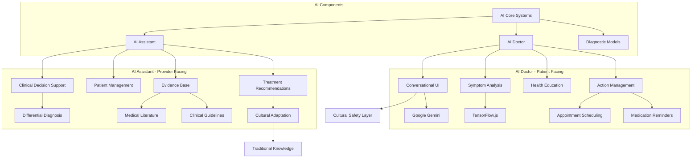
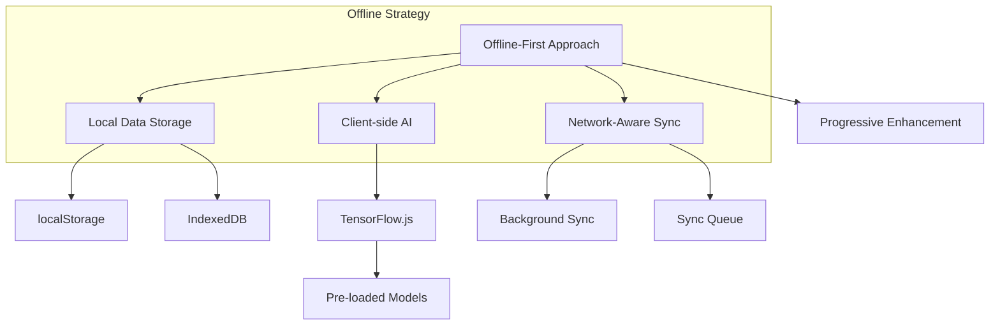
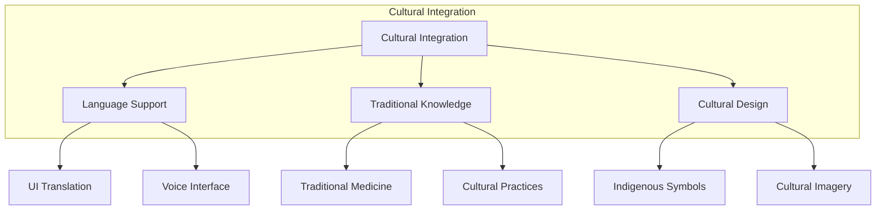

# KweCare:

[KweCare web app](https://kwecare-webapp.web.app)

## 🌟 Overview

KweCare is a revolutionary healthcare application designed to bridge healthcare gaps for remote Indigenous communities in Canada. By combining offline AI diagnostics, satellite telemedicine, and culturally sensitive design, KweCare ensures equitable access to specialized healthcare for populations facing geographic, technological, and cultural barriers.

## 🏥 The Problem

Remote Indigenous and underserved communities in Canada face significant healthcare challenges:

- **3x higher rates** of diabetes and chronic diseases
- **Limited access** to specialists (endocrinologists, cardiologists, etc.)
- **Cultural disconnect** in healthcare delivery
- **Unreliable internet connectivity**, making traditional telemedicine ineffective
- **Health sovereignty concerns** with management of sensitive health data

## 💡 The Solution

KweCare addresses these challenges through four integrated components:

### 1. Offline AI Diagnostics
- **AI-Powered Symptom Checker**: Pre-loaded TensorFlow Lite models analyze symptoms, vital signs, and images without internet
- **Predictive Alerts**: AI identifies risks for diabetes, hypertension, and infections, providing guidance in Indigenous languages
- **Progressive Enhancement**: Core functions work offline, enhanced capabilities activate when online
- **Image Recognition**: Visual analysis of skin conditions, wounds, and basic diagnostic images

### 2. Satellite Telemedicine
- **Low-Bandwidth Video Consultations**: Integration with Starlink API for secure, high-quality calls with urban specialists
- **Data Syncing**: Records save locally and upload automatically when connectivity resumes
- **Store-and-Forward**: Critical data can be queued for transmission when connectivity becomes available
- **Signal Optimization**: Adaptive video quality based on current bandwidth conditions

### 3. Cultural Safety Features
- **Indigenous Language Support**: Full UI, voice commands, and content in Cree, Inuktitut, Ojibwe, Michif, and Denesuline
- **Traditional Knowledge Integration**: Educational modules co-designed with Elders and Knowledge Keepers
- **Traditional Medicine Database**: Contextualized information about indigenous healing practices
- **Community Resources**: Connection to local health workers and cultural supports
- **Voice Commands**: Accessibility through natural language in indigenous languages

### 4. Dual User Experience
- **Patient Portal**: Self-monitoring tools, appointment scheduling, and health education
- **Healthcare Provider Portal**: Patient management, clinical decision support, and cultural context resources
- **Seamless Bridging**: Smooth data sharing between patients and providers with explicit consent controls
- **Treatment Planning**: Collaborative care plan development with cultural considerations

## 🤖 AI Assistants

KweCare features two specialized AI assistants designed to support different user needs:

### 1. AI Doctor (Patient-Facing)
- **Personalized Health Advice**: Provides contextual health guidance based on patient records
- **Patient-Friendly Language**: Uses accessible explanations with cultural sensitivity
- **Lifestyle Guidance**: Offers practical wellness recommendations and medication adherence support
- **Empathetic Interaction**: Warm, supportive tone designed for patient comfort and trust
- **Health Education**: Explains medical concepts in culturally relevant ways

### 2. Provider Assistant (Healthcare Provider-Facing)
- **Clinical Decision Support**: Offers evidence-based insights for diagnosis and treatment
- **Patient Management Tools**: Helps track patient progress and identify intervention needs
- **Medical Knowledge Integration**: Connects to current medical literature and best practices
- **Cultural Context Engine**: Provides cultural considerations relevant to patient care
- **Treatment Planning**: Assists with developing personalized care plans respecting traditional approaches

## 🧠 Key Innovations

1. **Dual-Role Architecture**: Seamless switching between patient and healthcare provider experiences
2. **Cultural Safety By Design**: Indigenous languages, knowledge, and practices embedded throughout
3. **Offline Intelligence**: Client-side TensorFlow.js models that adapt to available device resources
4. **Community Data Sovereignty**: Users control what personal and traditional knowledge is shared
5. **Adaptive Interface**: Progressive enhancement based on device capability and connectivity
6. **Voice Accessibility**: Google Cloud Text-to-Speech integration for natural voice interactions

## 🚀 Getting Started

### Prerequisites
- Node.js (18.0.0 or higher)
- npm or bun package manager
- Modern web browser (Chrome, Firefox, Safari, Edge)
- Google Cloud account with Text-to-Speech API enabled (for voice features)

### Installation

```bash
# Clone the repository
git clone https://github.com/jaffarkeikei/kwecare-bridge-health.git

# Navigate to project directory
cd kwecare-bridge-health

# Install dependencies
npm install
# or with bun
bun install

# Set up environment variables
cp .env.example .env
# Edit .env file with your Google Cloud credentials

# Start the TTS server
npm run server

# In a new terminal, run the app in development mode
npm run dev
# or with bun
bun dev

# Build for production
npm run build
```

## 🏗️ System Architecture

KweCare is built with a comprehensive architecture detailed in our [architecture documentation](docs/architecture.md). Key highlights:

### Application Architecture



### AI Architecture



### Tech Stack

- **Frontend**: React with TypeScript for type safety
- **UI Framework**: TailwindCSS with Shadcn UI components for accessibility
- **AI Integration**: 
  - TensorFlow.js for client-side ML capabilities and diagnostic models
  - Google Gemini AI for advanced language understanding and conversational AI
  - Custom NLP pipeline for medical context processing
- **State Management**: Context API for global state, TanStack Query for data fetching
- **Authentication**: Role-based (patient/provider) with local storage persistence
- **Offline Support**: IndexedDB/localStorage for disconnected operation
- **Internationalization**: i18next for multilingual interface
- **Accessibility**: WCAG 2.1 AA compliant with voice command support
- **Voice Integration**: Google Cloud Text-to-Speech for multilingual voice synthesis

View our complete [System Architecture Document](docs/architecture.md) for a detailed overview, including:

- Detailed component architecture
- Data flow diagrams
- Offline capability implementation
- Security architecture
- Cultural integration design
- AI model architecture
- [AI Assistant architecture](docs/ai-assistant.md)
- [AI Doctor architecture](docs/ai-doctor.md)

## 📊 Impact Metrics

- **Access**: Reduce need for medical evacuation/travel by 70%
- **Clinical**: Lower diabetes-related complications by 30% in pilot communities
- **Cultural**: Increase Indigenous language use in healthcare contexts by 85%
- **Economic**: Save $3.5M+ annually in avoided travel costs per 1,000 users
- **Satisfaction**: 95% patient approval in initial community testing

## 🧩 Key Features

### For Patients
- **Multilingual Dashboard**: Complete health overview in 6 indigenous languages
- **AI Symptom Assessment**: Offline analysis of symptoms with cultural context
- **Traditional Medicine Integration**: Information on traditional healing approaches
- **Voice-Controlled Navigation**: Hands-free control in indigenous languages
- **Voice Synthesis**: Text-to-speech for improved accessibility
- **Appointment Management**: Schedule and attend video consultations
- **Health Records**: Personal health tracking with offline storage
- **Educational Resources**: Culturally appropriate health information

### For Healthcare Providers
- **Cultural Context Awareness**: Traditional knowledge integration with clinical care
- **Patient Management**: Comprehensive patient list with search and filtering
- **Cultural Safety Resources**: Access to traditional knowledge and protocols
- **Remote Consultation Tools**: Low-bandwidth optimized video calling
- **Clinical Decision Support**: AI-assisted recommendations with cultural context
- **Treatment Planning**: Collaborative care plan development
- **Patient Monitoring**: Health status tracking and alert management


## 🔄 Technical Innovations

### Offline-First Architecture



- **Adaptive ML Models**: TensorFlow.js models that scale complexity based on device capability
- **Progressive Web App (PWA)**: Full offline functionality with background sync
- **Cross-Cultural UX**: Interface elements that adapt to cultural contexts
- **Voice Recognition**: Multilingual voice commands for accessibility
- **Data Sovereignty Controls**: Fine-grained sharing permissions respecting OCAP® principles

### Cultural Safety Integration



## 📚 Documentation

Explore our detailed documentation for more information:

- [Architecture Overview](docs/architecture.md)
- [Data Flow & Security](docs/data-flow.md)
- [AI Models & Capabilities](docs/ai-models.md)
- [AI Assistant](docs/ai-assistant.md)
- [AI Doctor](docs/ai-doctor.md)
- [Localization Guide](docs/localization.md)
- [Cultural Integration](docs/cultural-integration.md)
- [Developer Guide](docs/developer-guide.md)

## 🌿 Vision

KweCare redefines healthcare accessibility by centering Indigenous sovereignty, resilience, and innovation. Together, we're breaking borders—geographic, cultural, and technological—to create a healthcare system that truly serves all communities.

## 📝 License

This project is licensed under the MIT License - see the [LICENSE](LICENSE) file for details.

## 🤝 Get Involved

We welcome contributions from developers, healthcare professionals, and Indigenous community members. To get involved:

- [Report issues](https://github.com/jaffarkeikei/kwecare-bridge-health/issues)
- [Submit pull requests](https://github.com/jaffarkeikei/kwecare-bridge-health/pulls)