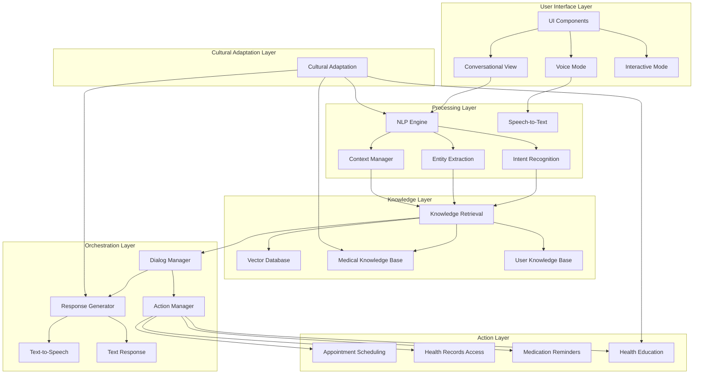
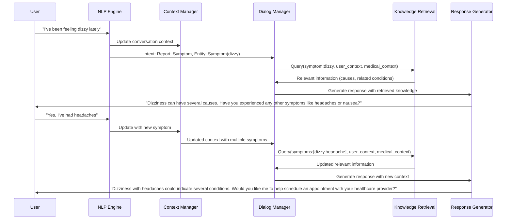
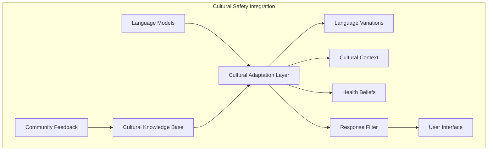
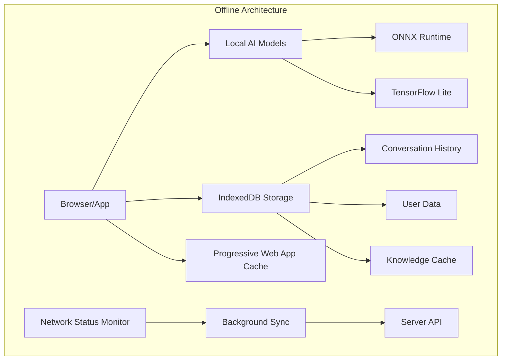
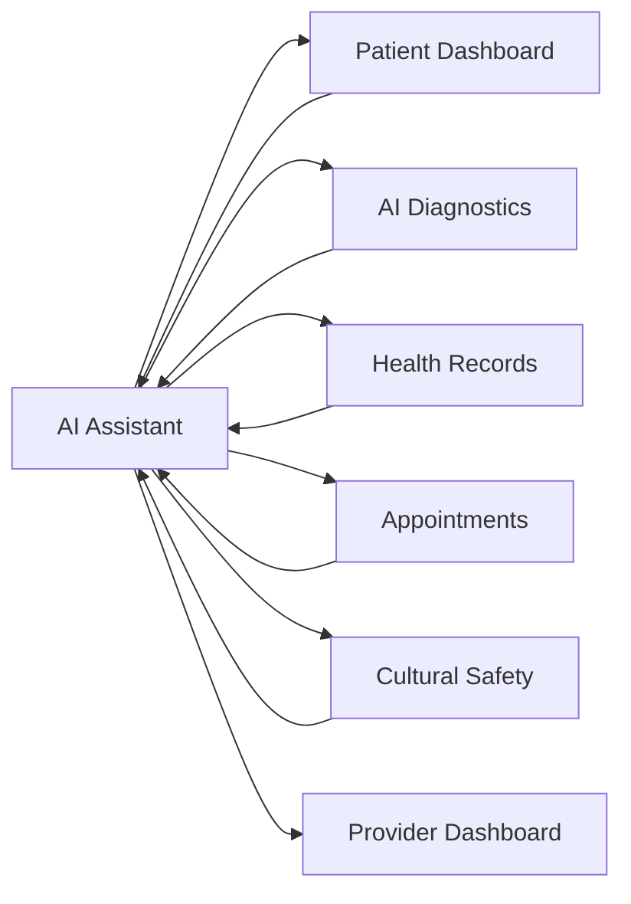

# AI Assistant Architecture

## Overview

The KweCare AI Assistant is an intelligent conversational interface designed to enhance healthcare accessibility and patient engagement. It serves as the primary point of interaction for patients seeking health information, guidance, and support through their healthcare journey.

## System Architecture Diagram

## Core Components

### 1. Natural Language Processing Engine

The NLP engine is responsible for understanding user inputs and converting them into structured representations that can be processed by the AI system.

| Component | Technology | Purpose |
|-----------|------------|---------|
| Intent Recognition | GPT-4, BERT | Identify the user's goal or request |
| Entity Extraction | Named Entity Recognition Models | Extract key information like symptoms, medications, dates |
| Context Manager | In-memory state + vector embedding | Maintain conversation context and reference history |
| Language Identification | CLD3, fastText | Detect language for multilingual support |

**Offline Capabilities:**
- Lightweight ONNX models for basic intent recognition
- Pre-cached entity recognition patterns
- Local conversation context storage

### 2. Knowledge Retrieval System

The knowledge retrieval system accesses and processes information from various sources to inform the AI Assistant's responses.

| Component | Technology | Purpose |
|-----------|------------|---------|
| Vector Database | Pinecone, Chroma | Store and retrieve semantically similar information |
| Medical Knowledge Base | UMLS, SNOMED CT Integration | Access standardized medical information |
| User Knowledge Base | Patient Records + Preferences | Personalize responses based on patient history |
| Evidence Retriever | PubMed API, Medical Guidelines DB | Source evidence-based information |

**Integration Points:**
- Medical terminology standardization with UMLS
- Patient record federation for contextual understanding
- Cultural knowledge integration for appropriate guidance

### 3. Dialog Management System

The dialog manager orchestrates the conversation flow and ensures coherent, helpful interactions.

### 4. Response Generation System

The response generator creates natural, informative, and culturally appropriate responses.

| Component | Technology | Purpose |
|-----------|------------|---------|
| Template Engine | Handlebars, GPT-4 | Structure responses for different scenarios |
| Personalization Engine | User Preference Models | Adapt tone, detail level, and terminology |
| Cultural Adaptation | Cultural Safety Rules Engine | Ensure cultural appropriateness |
| Multilingual Generation | Neural Machine Translation | Support indigenous and other languages |

**Response Quality Controls:**
- Medical accuracy verification against knowledge base
- Uncertainty expression for non-definitive information
- Cultural sensitivity review for appropriate terminology
- Simplification for health literacy levels

### 5. Action Management System

The action manager executes tasks based on user requests and conversation context.

| Action Type | Integration Points | Capabilities |
|-------------|-------------------|--------------|
| Appointment Scheduling | Calendar API, Provider Availability | Book, reschedule, cancel appointments |
| Health Record Access | Patient Record System | Retrieve, summarize, explain health data |
| Medication Management | Medication Database, Reminder System | Set up reminders, answer medication questions |
| Health Education | Content Repository, Learning Platform | Deliver personalized educational content |

## Cultural Safety Integration

Cultural safety is deeply integrated into the AI Assistant architecture:

Key cultural safety features include:
- Indigenous language support with medical terminology mapping
- Traditional knowledge integration with Western medical concepts
- Community-validated response patterns
- Cultural protocols for sensitive health topics
- Elder wisdom incorporation

## Offline-First Architecture

The AI Assistant implements a sophisticated offline capability system:

## Privacy and Security

The AI Assistant prioritizes privacy and security:

| Feature | Implementation | Purpose |
|---------|----------------|---------|
| Data Minimization | Need-to-know processing | Process only necessary information |
| Local Processing | On-device models | Keep sensitive data on device when possible |
| Encrypted Storage | AES-256 encryption | Protect stored conversation history |
| Consent Management | Granular permissions | Clear opt-in for health data access |
| Audit Logging | Secure activity logs | Track all system actions for accountability |

## Performance Optimization

Performance optimizations ensure the AI Assistant works effectively in low-resource environments:

| Technique | Implementation | Benefit |
|-----------|----------------|---------|
| Model Quantization | 8-bit quantized models | Reduced model size for faster loading |
| Progressive Enhancement | Tiered capability loading | Basic functions work on all devices |
| Response Caching | Local cache for common queries | Reduced latency for frequent interactions |
| Adaptive Processing | Resource-aware computation | Adjust processing based on device capabilities |

## Integration Points with Other KweCare Components

## Future Development Roadmap

The AI Assistant development roadmap includes:

1. **Enhanced Multimodal Capabilities**
   - Visual symptom recognition
   - Emotion detection for mental health support
   - Gesture-based interaction for accessibility

2. **Advanced Personalization**
   - Learning user communication preferences over time
   - Adapting to user health literacy levels
   - Customizable AI personality traits

3. **Expanded Cultural Integration**
   - Additional indigenous language support
   - Community-specific health guidance
   - Traditional healing practice integration

4. **Clinical Decision Support**
   - Triage assistance with provider oversight
   - Treatment adherence monitoring
   - Recovery progress tracking 