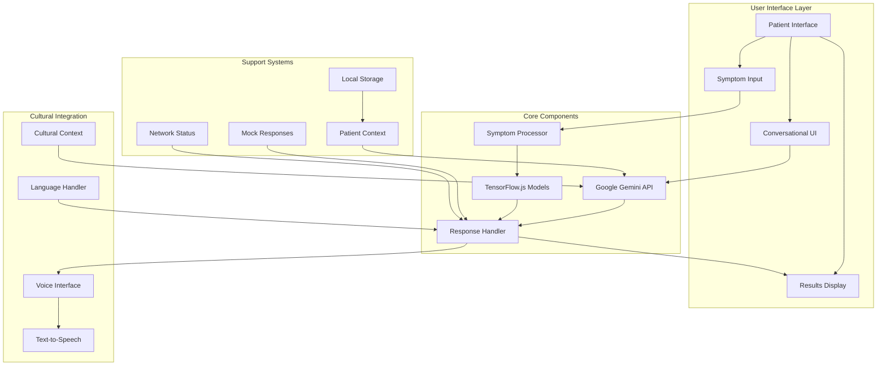

# AI Doctor Architecture

## Overview

The KweCare AI Doctor is a patient-facing conversational interface designed to assist patients with health questions, preliminary symptom assessment, and healthcare guidance. It leverages Google Gemini for natural language understanding and simple TensorFlow.js models for basic health predictions while maintaining a focus on cultural safety and accessibility.

## System Architecture Diagram



## Core Components

### 1. Conversational Interface

The conversational interface provides a natural language interaction channel between the patient and the AI system.

| Component | Technology | Purpose |
|-----------|------------|---------|
| Input Handler | React + TypeScript | Process user text/voice input |
| Message Display | React Components | Present conversational history |
| Context Manager | Session Storage | Maintain conversation state |
| Gemini Integration | Google Gemini API | Generate contextually relevant responses |

**Key Features:**
- Natural language conversation in multiple languages
- Context-aware responses based on conversation history
- Cultural sensitivity in linguistic patterns
- Fallback to mock responses when offline

### 2. Symptom Analysis

The symptom analysis component uses simple machine learning models to process patient-reported symptoms.

| Component | Technology | Purpose |
|-----------|------------|---------|
| Symptom Encoder | JavaScript | Convert symptom descriptions to model inputs |
| Prediction Model | TensorFlow.js | Process symptom data for preliminary assessment |
| Result Interpreter | JavaScript | Convert model outputs to understandable guidance |

**Model Architecture:**
- Simple feedforward neural network with 2-3 layers
- Binary encoding of common symptoms as inputs
- Basic probability outputs for common conditions
- Lightweight design for browser execution

### 3. Patient Context Manager

The patient context manager maintains relevant patient information to personalize AI responses.

| Component | Technology | Purpose |
|-----------|------------|---------|
| Profile Storage | localStorage | Store basic patient information |
| Context Builder | JavaScript | Format patient data for prompt enhancement |
| History Manager | sessionStorage | Track conversation and symptom history |

### 4. Cultural Adaptation Layer

The cultural adaptation layer ensures that interactions are culturally appropriate and accessible.

| Component | Technology | Purpose |
|-----------|------------|---------|
| Language Selector | React UI | Allow selection of preferred language |
| Prompt Engineering | Contextual prompts | Include cultural considerations in AI guidance |
| Voice Interface | Google Cloud TTS | Provide spoken responses in multiple languages |

## Implementation Details

### Google Gemini Integration

```javascript
// Core Gemini API integration
public async generateResponse(
  messages: GeminiMessage[],
  patientData: PatientData,
  options: GeminiRequestOptions = {}
): Promise<string> {
  if (!this.isInitialized()) {
    throw new Error('Gemini API not initialized. Call initialize() first.');
  }
  
  const contextualPrompt = this.buildContextualPrompt(patientData, options.language);
  
  // If no API key is available, use mock responses
  if (!this.apiKey) {
    console.warn('No Gemini API key provided. Using mock responses.');
    return this.getMockResponse(messages[messages.length - 1].content, patientData, options.language);
  }
  
  try {
    // Prepare messages with system context
    const enhancedMessages = [
      { role: 'system', content: contextualPrompt },
      ...messages
    ];
    
    // Make request to Gemini API
    // Process response
    // Return formatted result
  } catch (error) {
    // Fallback to mock responses on error
    return this.getMockResponse(messages[messages.length - 1].content, patientData, options.language);
  }
}
```

### TensorFlow.js Symptom Model

```javascript
// Simple symptom model
export const createSymptomModel = async (simplified = true): Promise<tf.LayersModel> => {
  const model = tf.sequential();
  
  // For simplified model, use smaller architecture
  const hiddenUnits = simplified ? 8 : 16;
  
  // Input layer - assuming we encode symptoms as binary features
  model.add(tf.layers.dense({
    inputShape: [12], // Common symptoms count
    units: hiddenUnits, 
    activation: 'relu'
  }));
  
  model.add(tf.layers.dense({
    units: simplified ? 4 : 8,
    activation: 'relu'
  }));
  
  // Output layer - multiple conditions probability
  model.add(tf.layers.dense({
    units: 5, // Number of possible conditions to predict
    activation: 'sigmoid'
  }));
  
  // Compile the model
  model.compile({
    optimizer: tf.train.adam(),
    loss: 'binaryCrossentropy',
    metrics: ['accuracy']
  });
  
  return model;
};
```

## Offline Capabilities

The AI Doctor implements practical offline capabilities:

| Feature | Implementation | Benefit |
|---------|----------------|---------|
| Mock Responses | Pre-defined response templates | Basic functionality when API is unavailable |
| Local TensorFlow Models | Simple client-side models | Symptom analysis without internet connection |
| Session Storage | Browser storage APIs | Conversation persistence during session |

## Cultural Safety Features

Cultural safety is integrated through:

- Multilingual support via Google Gemini
- Cultural context inclusion in prompts
- Voice synthesis in indigenous languages
- Culturally appropriate health guidance
- Simple, accessible language choices

## Integration with Other Components

The AI Doctor integrates with:
- Patient Dashboard for contextual information
- Health Records for patient history context
- Appointments for scheduling suggestions
- Text-to-Speech for accessibility

## Roadmap for Future Development

1. **Enhanced Health Models**
   - Improved symptom analysis accuracy
   - Additional health condition coverage
   - Integration with patient-reported metrics

2. **Advanced Personalization**
   - Learning from patient interaction patterns
   - Adaptive health literacy levels
   - More extensive cultural customization

3. **Expanded Accessibility**
   - Additional indigenous language support
   - Image-based symptom reporting
   - Improved offline capabilities 