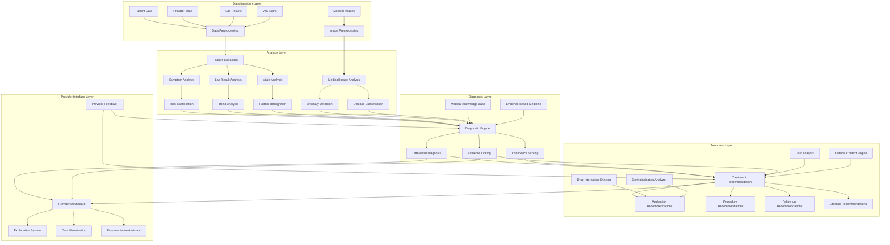
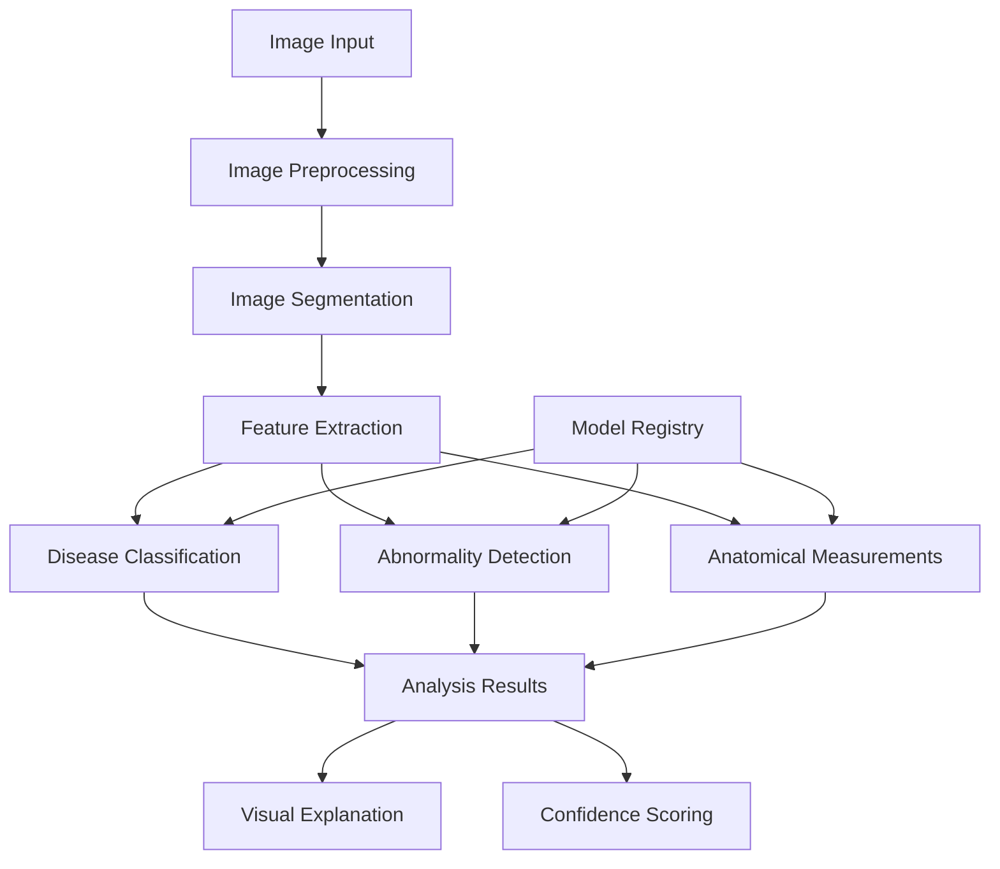
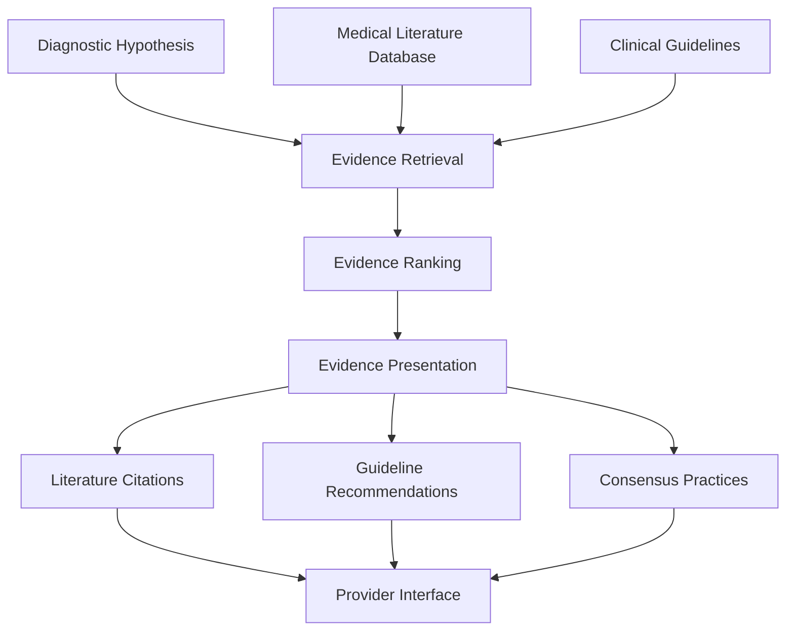
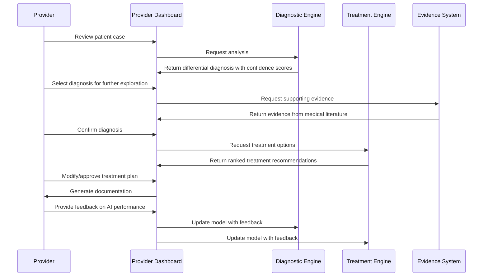
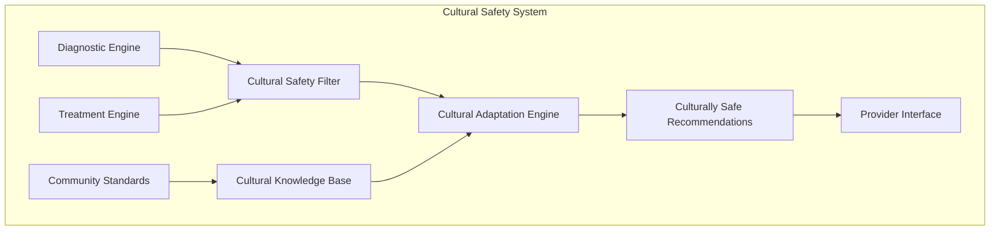
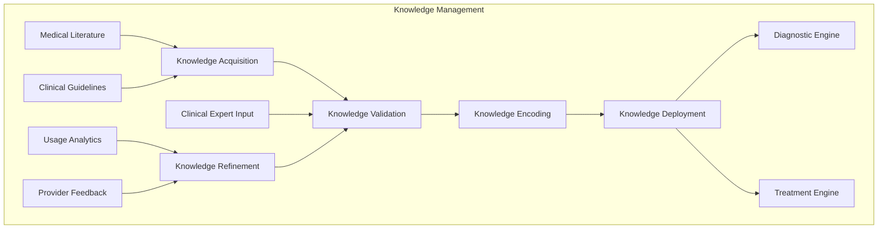
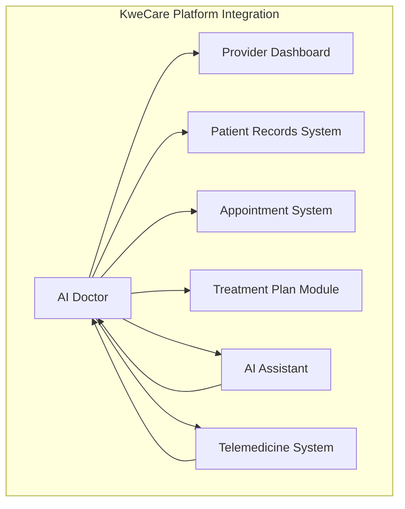
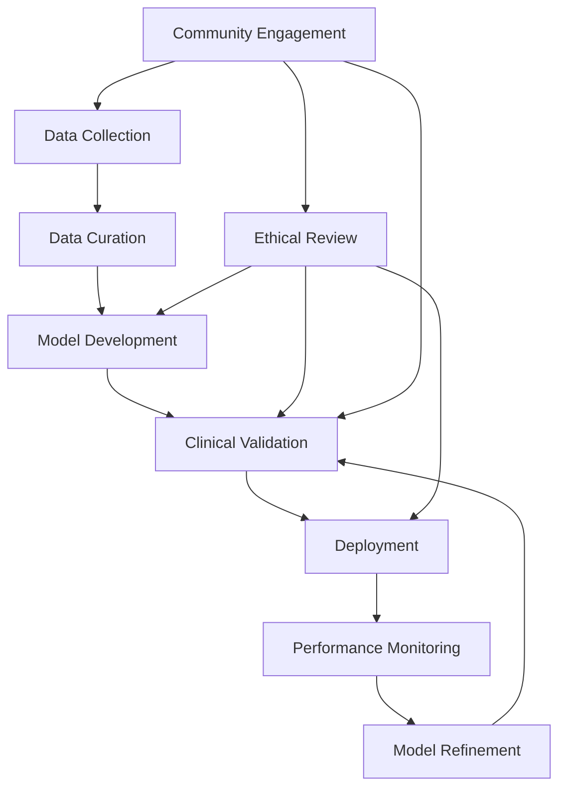

# AI Doctor Architecture

## Overview

The KweCare AI Doctor is an advanced clinical decision support system designed to assist healthcare providers with diagnostics, treatment planning, and patient management. It leverages state-of-the-art medical AI models while maintaining a provider-in-the-loop approach to ensure safe, effective, and culturally appropriate care.

## System Architecture Diagram

## Core Components

### 1. Data Processing Engine

The data processing engine ingests, normalizes, and prepares diverse patient data for AI analysis.

| Component | Technology | Purpose |
|-----------|------------|---------|
| Data Connectors | HL7 FHIR, DICOM | Standardized medical data ingestion |
| Data Normalizers | UMLS Mappers, Custom ETL | Convert diverse data to standard formats |
| Feature Extractors | Statistical Analysis, Neural Networks | Extract meaningful features from raw data |
| Time Series Processors | LSTM Networks, Signal Processing | Process temporal health data patterns |

**Data Types Processed:**
- Structured medical records (demographics, conditions, medications)
- Unstructured clinical notes
- Laboratory results with reference ranges
- Medical imaging data (X-rays, CT scans, etc.)
- Vital sign measurements
- Patient-reported symptoms

### 2. Medical Image Analysis System

The image analysis system applies deep learning to detect anomalies in medical images.

**Model Architecture:**
- Ensemble of specialized CNN models for different imaging modalities
- Vision Transformer models for complex pattern recognition
- RadImageNet pre-trained backbones with transfer learning
- Regional attention mechanisms for localized analysis

### 3. Differential Diagnosis Engine

The diagnostic engine applies medical reasoning to patient data and generates potential diagnoses.

| Component | Technology | Purpose |
|-----------|------------|---------|
| Symptom Analyzer | MedicalBERT, Knowledge Graphs | Process symptom descriptions and relationships |
| Lab Interpreter | Rule-based + Neural Networks | Interpret lab values within clinical context |
| Bayesian Network | Probabilistic Models | Calculate condition probabilities based on evidence |
| Diagnostic Ranker | Ranking Algorithms | Order potential diagnoses by likelihood |

**Key Capabilities:**
- Multi-symptom correlation with medical knowledge base
- Age, sex, and demographic-specific probability adjustments
- Consideration of patient history and risk factors
- Rare disease identification with appropriate flagging
- Integration of lab and imaging findings with symptoms

### 4. Evidence-Based Medicine Integration

The evidence integration system links diagnoses and recommendations to medical literature and guidelines.

**Evidence Sources:**
- PubMed/MEDLINE medical literature database
- Clinical practice guidelines from medical societies
- Cochrane Reviews and meta-analyses
- Drug formularies and pharmaceutical databases
- Indigenous health research and cultural practice sources

### 5. Treatment Recommendation System

The treatment recommendation system suggests evidence-based interventions tailored to the patient.

| Component | Technology | Purpose |
|-----------|------------|---------|
| Treatment Selector | Rule-based + Deep Learning | Match conditions with appropriate treatments |
| Drug Interaction Checker | Pharmaceutical Database | Verify medication safety and interactions |
| Personalization Engine | Patient Data Analysis | Adapt recommendations to patient specifics |
| Outcome Predictor | Statistical Models | Estimate likelihood of treatment success |

**Recommendation Features:**
- Primary and alternative treatment pathways
- Stepped care approach for progressive interventions
- Cost-effectiveness considerations
- Availability of medications/treatments in remote settings
- Cultural appropriateness of recommendations
- Traditional medicine integration where appropriate

### 6. Provider Interface System

The provider interface presents AI insights in an interpretable, actionable format for healthcare providers.

**Interface Features:**
- Interactive differential diagnosis explorer
- Visual evidence presentation with source citations
- Treatment comparison tools with outcome predictions
- Documentation generation with AI-assisted coding
- Provider feedback mechanism for continuous improvement

## Cultural Safety Integration

Cultural safety is a fundamental aspect of the AI Doctor architecture:

Key cultural safety features include:
- Indigenous cultural practices integration with treatment options
- Traditional medicine considerations alongside Western approaches
- Cultural competency guidance for providers
- Community-specific health considerations
- Support for indigenous language medical terminology
- Ethical alignment with indigenous data sovereignty principles

## Ethical AI Framework

The AI Doctor implements a comprehensive ethical framework:

| Principle | Implementation | Safeguards |
|-----------|----------------|------------|
| Provider-in-the-Loop | Approval workflow | AI suggestions require provider review |
| Transparency | Explainable AI methods | Clear explanation of AI reasoning |
| Fairness | Bias detection | Monitoring for demographic disparities |
| Safety | Confidence thresholds | Conservative recommendations when uncertain |
| Privacy | Data minimization | Processing only necessary information |
| Continuous Validation | Clinical validation | Regular testing against gold standards |

## Knowledge Management System

The knowledge management system ensures the AI Doctor's reasoning is based on current medical understanding:

## Offline Capabilities

The AI Doctor implements targeted offline capabilities for remote healthcare settings:

| Feature | Implementation | Benefit |
|---------|----------------|---------|
| Compressed AI Models | Quantized Models, Knowledge Distillation | Run core diagnostics with limited resources |
| Critical Knowledge Cache | Prioritized Medical Knowledge | Access essential information offline |
| Sync-on-Connection | Background Sync, Delta Updates | Update knowledge when connectivity available |
| Low-Resource Diagnostics | Rule-based Fallbacks | Basic diagnostic support without cloud AI |

## Security and Compliance

The AI Doctor implements healthcare-specific security measures:

| Feature | Implementation | Purpose |
|---------|----------------|---------|
| PHI Protection | Containerized Processing | Isolate protected health information |
| Access Controls | Role-based + Contextual Access | Limit data access to appropriate providers |
| Audit Trail | Immutable Logging | Track all AI recommendations and provider interactions |
| Regulatory Alignment | HIPAA, GDPR Compliance | Meet healthcare data protection requirements |
| Indigenous Data Sovereignty | Community-directed Controls | Respect indigenous rights to data control |

## Integration with KweCare Platform

Key integration points include:
- Seamless workflow with provider dashboard
- Patient context sharing with AI Assistant
- Treatment plan generation for provider review
- Documentation support for patient encounters
- Telemedicine integration for remote diagnoses

## Development and Validation Workflow

## Future Development Roadmap

The AI Doctor development roadmap includes:

1. **Advanced Multimodal Integration**
   - Genomic data integration for precision medicine
   - Wearable device data for continuous monitoring
   - Environmental data correlation with health outcomes

2. **Enhanced Reasoning Capabilities**
   - Causal inference for complex condition relationships
   - Temporal reasoning for disease progression modeling
   - Uncertainty quantification for more reliable diagnoses

3. **Collaborative Intelligence Features**
   - Provider-to-provider case collaboration tools
   - Cross-specialty consultation support
   - Community health pattern identification

4. **Extended Cultural Integration**
   - Additional indigenous knowledge systems integration
   - Community-specific health protocol development
   - Traditional wellness approach incorporation 