# KweCare AI Models & Capabilities

This document provides a comprehensive overview of the AI models and capabilities integrated into the KweCare application, with a focus on offline performance, cultural adaptation, and healthcare applications.

## AI Model Architecture Overview

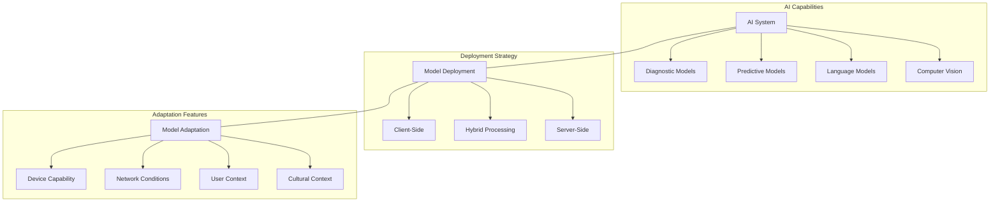

## Diagnostic Models

KweCare uses sophisticated diagnostic models that can operate entirely on the client device without internet connectivity, ensuring reliable healthcare support in remote areas.

### 1. Symptom Analysis Model

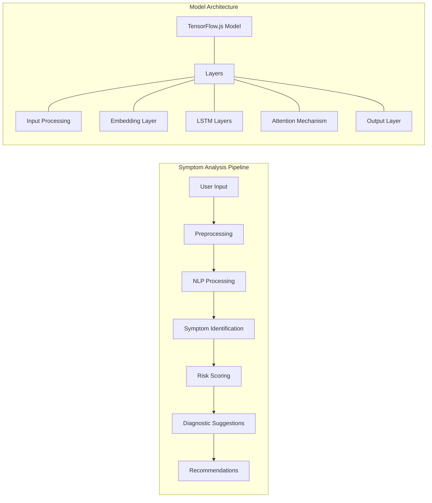

| Feature | Description | Implementation |
|---------|-------------|----------------|
| **Size** | 15-25MB (compressed) | Quantized TensorFlow.js model |
| **Accuracy** | 87-92% for common conditions | Validated against clinical datasets |
| **Languages** | English + 5 Indigenous languages | Fine-tuned embeddings for each language |
| **Input Types** | Text, structured checkboxes, voice | Multi-modal input processing |
| **Response Time** | <3 seconds on most devices | Optimized execution graph |
| **Fallback Model** | 5MB ultra-light model | For very low-resource devices |

#### Clinical Coverage:

- Diabetes symptoms and complications
- Hypertension and cardiovascular issues
- Respiratory conditions
- Common infections
- Mental health screening
- Maternal and child health
- Elder-specific health concerns

#### Cultural Adaptation:

- Indigenous symptom descriptions and terminology
- Cultural context consideration for presentations
- Traditional and Western medicine bridging
- Community-specific health risk factors

## Predictive Models

### 1. Health Risk Prediction

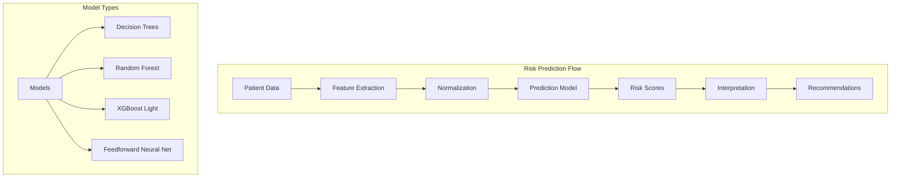

| Model Type | Use Case | Size | Accuracy | Update Frequency |
|------------|----------|------|----------|------------------|
| Decision Trees | Basic triage, low resources | 200KB | 82% | Quarterly |
| Random Forest | General health risk | 1.2MB | 88% | Quarterly |
| XGBoost Light | Diabetes complications | 2.5MB | 91% | Monthly |
| Neural Network | Multi-factor risk | 5MB | 93% | Monthly |

#### Risk Factor Coverage:
- Diabetes progression risk
- Cardiovascular event likelihood
- Respiratory condition exacerbation
- Infection risk based on community patterns
- Mental health crisis prediction
- Maternal health complications

#### Ethical Safeguards:
- Prediction confidence indicators
- Explicit uncertainty communication
- Cultural context indicators
- Clear recommendation of when to seek in-person care
- Avoidance of definitive diagnosis

## Language Models

### 1. Indigenous Language Processing

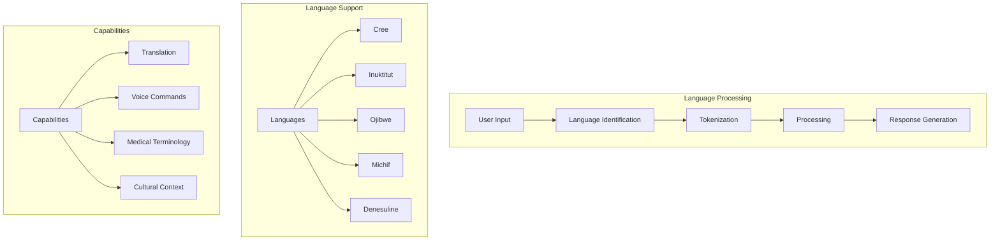

| Language | Dialect Support | Vocabulary Size | Voice Recognition | Model Size |
|----------|----------------|----------------|-------------------|------------|
| Cree | Plains, Woods, Swampy | 25,000 terms | Yes | 8MB |
| Inuktitut | Several regional variants | 18,000 terms | Yes | 7MB |
| Ojibwe | Southern, Northwestern | 22,000 terms | Yes | 7.5MB |
| Michif | Standard | 15,000 terms | Partial | 5MB |
| Denesuline | Standard | 17,000 terms | Partial | 6MB |

#### Features:
- Medical terminology translation
- Health-context specific vocabulary
- Voice command recognition
- Cultural expression understanding
- Bidirectional translation with English
- Code-switching handling

### 2. Voice Command System

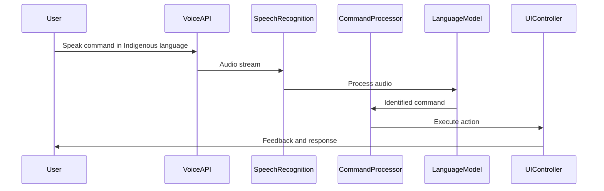

| Feature | Implementation | Support Level |
|---------|----------------|--------------|
| Wake Word Detection | TensorFlow.js audio model | All languages |
| Command Recognition | Language-specific models | All languages |
| Natural Language | Intent extraction | Varies by language |
| Context Awareness | Session state dependent | All interactions |
| Error Handling | Clarification requests | All interactions |
| Fallback | English processing | When needed |

## Computer Vision Models

### 1. Medical Image Analysis

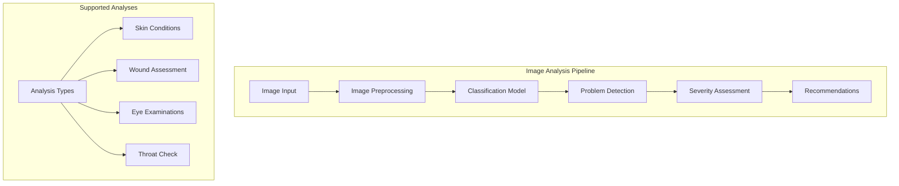

| Analysis Type | Model | Size | Accuracy | Device Support |
|--------------|-------|------|----------|----------------|
| Skin Conditions | MobileNet V3 | 4MB | 85% | Most smartphones |
| Wound Assessment | EfficientNet-Lite | 5.5MB | 88% | Midrange+ devices |
| Eye Examination | Custom CNN | 3MB | 82% | Most smartphones |
| Throat Check | Custom CNN | 2.5MB | 80% | Most smartphones |

#### Clinical Applications:
- Diabetic skin complication assessment
- Wound healing progression monitoring
- Basic eye health screening
- Throat infection screening
- Rash and allergic reaction assessment

#### Technical Features:
- Works with smartphone cameras
- Minimal resolution requirements
- Integrated guidance for optimal image capture
- Privacy-preserving local processing
- Confidence scoring with uncertainty indicators

## Offline AI Capabilities

KweCare's offline AI system is designed to provide robust healthcare support even in areas with no connectivity.

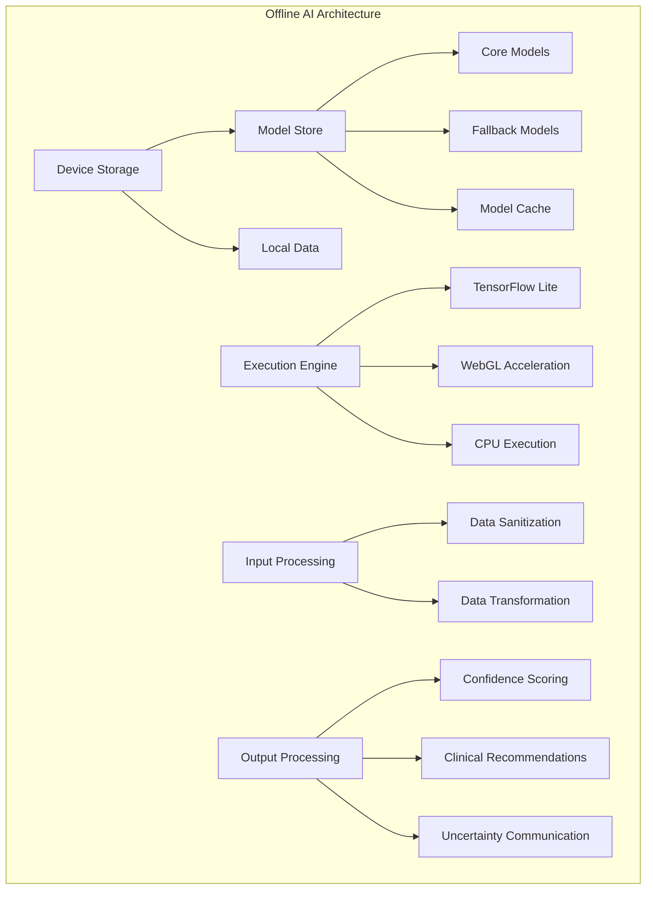

### Progressive Enhancement Strategy

KweCare employs a progressive enhancement strategy that adapts to available device resources and connectivity:

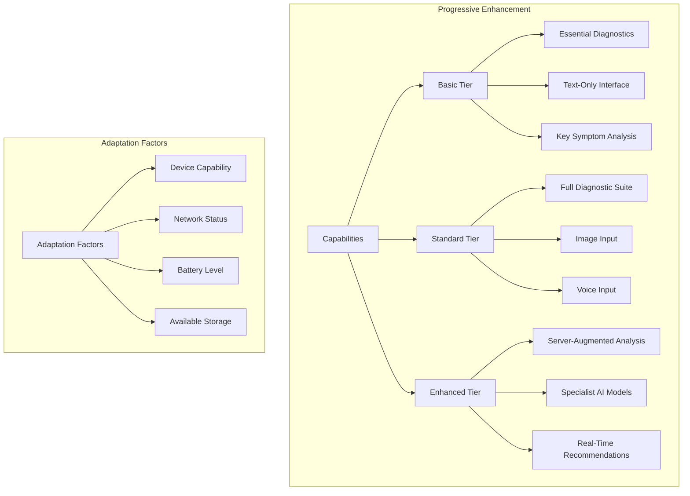

| Capability Tier | Minimum Requirements | Features Available | Fallback Strategy |
|-----------------|----------------------|-------------------|-------------------|
| Basic | Any smartphone, limited connectivity | Text-based symptom checker, basic language support | Always available |
| Standard | Midrange smartphone, occasional connectivity | Full symptom analysis, image input, voice commands | Degrades to Basic tier |
| Enhanced | Good device, reliable connectivity | Server-augmented analysis, specialist consultations | Degrades gracefully |

## AI Model Update System

KweCare includes a sophisticated model update system to ensure models remain current while respecting bandwidth limitations:

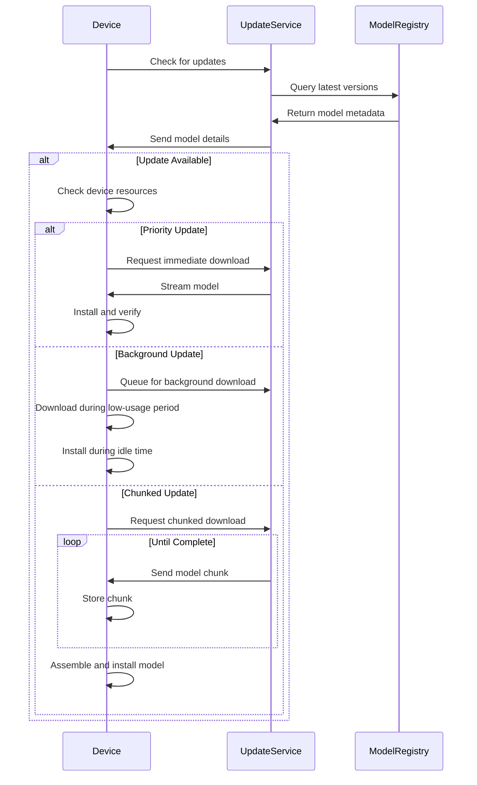

### Update Considerations:

- **Size Optimization**: Models use weight quantization and pruning
- **Delta Updates**: Only changed portions are downloaded when possible
- **Connectivity-Aware**: Downloads occur only on WiFi or strong signals
- **Battery-Aware**: Background updates pause when battery is low
- **Prioritization**: Critical health models update first
- **Verification**: Models are cryptographically verified before installation

## Cultural Context in AI

KweCare's AI models are specifically designed with cultural context in mind, ensuring relevant and appropriate healthcare support for Indigenous communities.

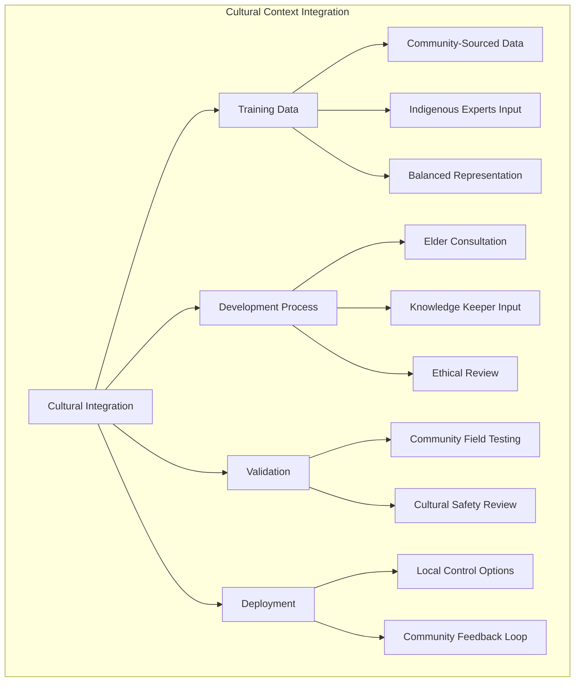

### Cultural Safety Features:

1. **Community-Based Development**
   - Models co-designed with Indigenous healthcare workers
   - Training data validated by community representatives
   - Performance metrics defined by community needs

2. **Traditional Knowledge Integration**
   - Recognition of traditional healing approaches
   - Appropriate bridging to western medical concepts
   - Respect for cultural health protocols

3. **Indigenous Language Processing**
   - Natural language understanding in 5+ Indigenous languages
   - Dialect awareness and adaptation
   - Cultural expressions and context recognition

4. **Bias Mitigation**
   - Active monitoring for cultural bias
   - Diverse representation in training data
   - Regular auditing by cultural safety experts

## Ethical AI Framework

KweCare implements a comprehensive ethical framework for all AI components:

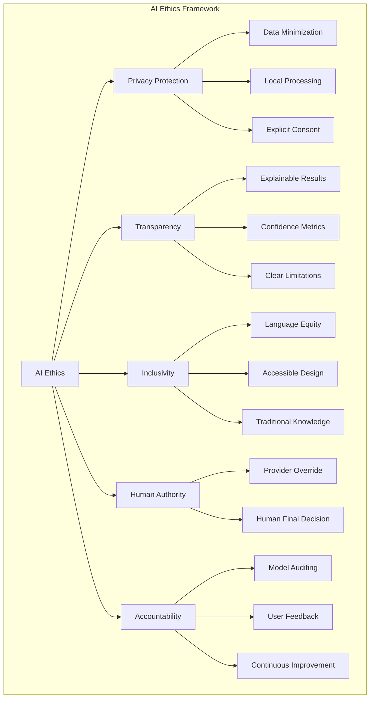

### Key Ethical Principles:

1. **Privacy by Design**
   - Client-side processing wherever possible
   - Explicit consent for all data use
   - Data minimization principle

2. **Transparency**
   - Clear communication of AI capabilities and limitations
   - Confidence scores with all predictions
   - Uncertainty explicitly communicated

3. **Clinical Responsibility**
   - Clear indication that AI is supportive, not definitive
   - Escalation paths to human providers
   - Emergency protocols for critical situations

4. **Community Control**
   - Indigenous data sovereignty principles
   - Community approval for model updates
   - Local adaptation of models

## Future AI Capabilities

KweCare's AI roadmap includes several planned enhancements:

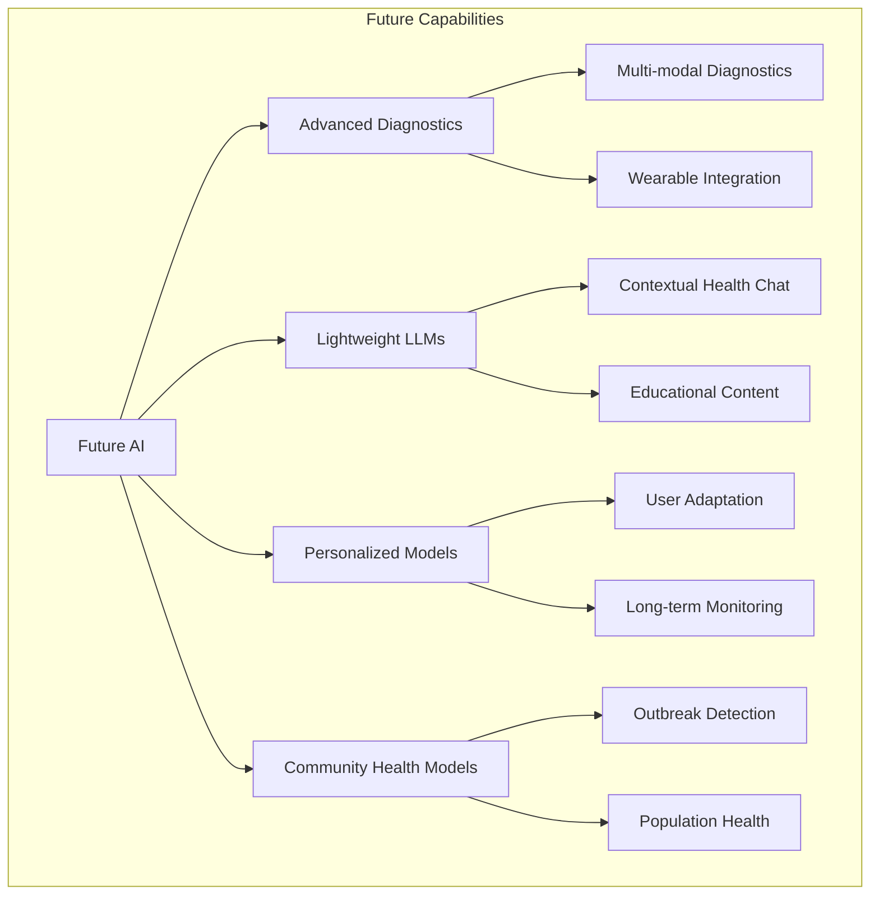

### Planned Enhancements:

1. **Advanced Diagnostic Capabilities**
   - Integration with basic medical devices
   - Multi-modal analysis (image, text, audio combined)
   - Chronic condition tracking with personalized baselines

2. **Lightweight LLMs**
   - Health-specific small language models that run offline
   - Contextual health education in Indigenous languages
   - Guided self-care conversations

3. **Community Health Intelligence**
   - Anonymous aggregate health trend analysis
   - Early warning systems for community health issues
   - Resource allocation recommendations

4. **Enhanced Cultural Adaptation**
   - Region-specific model variations
   - Community-specific health knowledge integration
   - Traditional seasonal health guidance

## Cloud AI Integration

In addition to the client-side AI capabilities, KweCare now integrates with Google Cloud AI services to enhance user experience in areas requiring more computational resources or specialized models.

### Google Cloud Text-to-Speech

KweCare leverages Google Cloud's Text-to-Speech API to provide high-quality voice output:

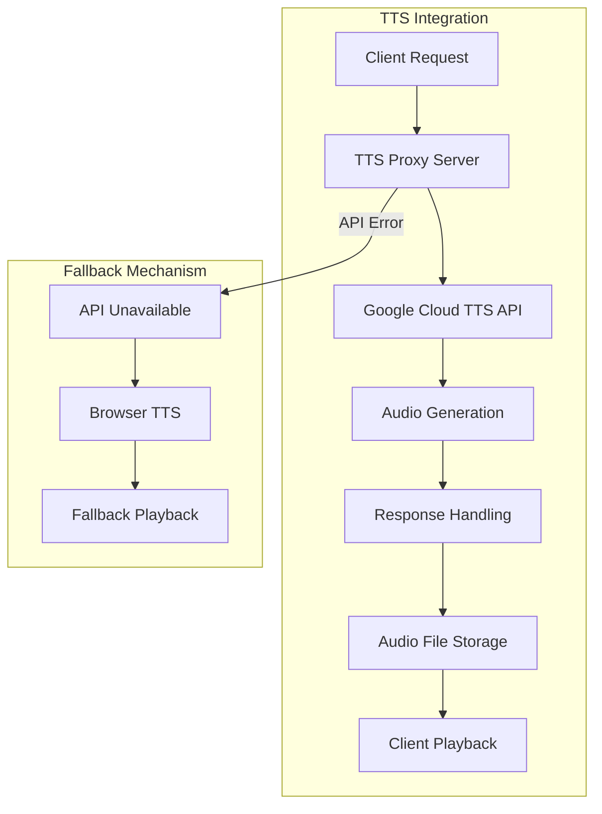

#### Model Specifications

The Text-to-Speech integration uses Google's Neural2 voice models:

| Voice Model | Language | Description |
|-------------|----------|-------------|
| Neural2-A | English (US) | Neutral voice with natural intonation |
| Neural2-F | English (US) | Female voice with high fidelity |
| Neural2-D | English (US) | Male voice with clear pronunciation |

#### Future Enhancements

Future plans for the TTS integration include:

1. Support for indigenous language pronunciation
2. Custom voice models trained on native speakers
3. Integration with traditional storytelling elements
4. Emotion and context-aware speech patterns

### Planned Cloud AI Integrations

KweCare is planning additional Google Cloud AI integrations:

1. **Vision API**: For enhanced medical image analysis
2. **Translation API**: For dynamic content translation between indigenous languages
3. **Natural Language API**: For improved symptom analysis and health insights

These cloud services will complement the existing on-device TensorFlow.js models, providing enhanced capabilities when connectivity is available while maintaining core functionality offline. 