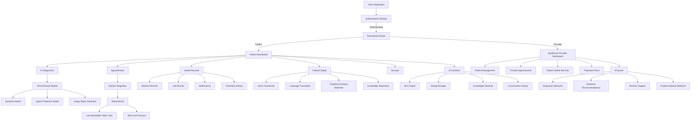
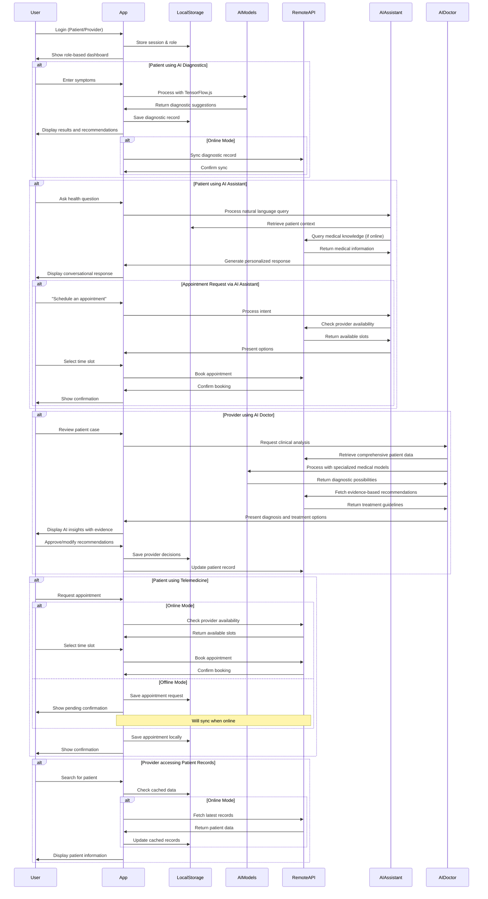
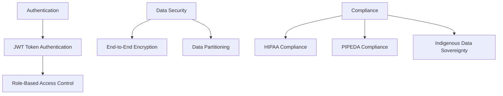

# KweCare Architecture Overview

## System Architecture Diagram



## Component Architecture

KweCare is built with a modular architecture that ensures separation of concerns and enables offline functionality where needed. The application is structured as follows:

### 1. Core Application Layers

| Layer | Description | Key Components |
|-------|-------------|----------------|
| **UI Layer** | User interface components built with React and Tailwind CSS | Header, Footer, Cards, Forms |
| **Routing Layer** | Path-based navigation with role-based access control | BrowserRouter, Protected Routes |
| **State Management** | Context API for global state, React Query for data fetching | AuthContext, QueryClient |
| **Business Logic** | Feature-specific logic and integrations | Authentication, AI Models, Telemedicine |
| **Storage Layer** | Local storage for offline functionality | Profile data, Health records, AI models |

### 2. Feature Modules

#### Authentication Module
- Login/Signup with role selection (Patient/Provider)
- Session management with local/session storage
- Role-based routing and permissions

#### Patient Dashboard Module
- Overview with health metrics and upcoming appointments
- Context-aware navigation between health features
- Voice command integration for accessibility

#### Healthcare Provider Module
- Patient management and search
- Appointment scheduling
- Access to patient health records
- Treatment planning

#### AI Diagnostics Module
- Offline-capable TensorFlow.js models
- Symptom checker with natural language processing
- Health predictions based on vitals and metrics
- AI Insights with personalized recommendations

#### AI Assistant Module
- **Core Components**
  - Conversational UI with natural language processing
  - Context-aware knowledge retrieval system
  - Personalized assistance engine
  - Multi-modal interaction (text, voice, visual)

- **Technical Architecture**
  ```mermaid
  graph TD
    Input[User Input] --> NLP[Natural Language Processing]
    NLP --> Intent[Intent Recognition]
    NLP --> Entity[Entity Extraction]
    
    Intent --> Context[Context Manager]
    Entity --> Context
    Context --> KR[Knowledge Retrieval]
    
    KR --> DM[Dialog Manager]
    DM --> ResponseGen[Response Generator]
    ResponseGen --> Output[User Interface]
    
    Context --> History[Conversation History]
    History --> DM
    
    KR --> MedKB[Medical Knowledge Base]
    KR --> UserProfile[User Profile & Preferences]
    KR --> HealthRecords[Health Records Access]
  ```

- **Functional Capabilities**
  - Health record navigation and summarization
  - Appointment scheduling and reminders
  - Medication tracking with smart alerts
  - Treatment plan explanation and adherence support
  - Health education with personalized content
  - Cultural customization for appropriate health guidance

- **Offline Capabilities**
  - Core functions available without connectivity
  - Pre-cached responses for common questions
  - Lightweight NLP models running client-side

#### AI Doctor Module
- **Core Components**
  - Advanced diagnostic inference engine
  - Multi-modal medical data processor
  - Treatment recommendation system
  - Provider decision support system

- **Technical Architecture**
  ```mermaid
  graph TD
    RawData[Patient Data] --> PreProc[Data Preprocessing]
    PreProc --> Feature[Feature Extraction]
    Feature --> DNN[Deep Neural Networks]
    
    DNN --> Symptom[Symptom Analysis]
    DNN --> Image[Medical Image Analysis]
    DNN --> Text[Medical Text Analysis]
    DNN --> Vitals[Vitals Pattern Recognition]
    
    Symptom --> Diagnostic[Diagnostic Model]
    Image --> Diagnostic
    Text --> Diagnostic
    Vitals --> Diagnostic
    
    Diagnostic --> Conditions[Potential Conditions]
    Diagnostic --> Confidence[Confidence Scores]
    
    Conditions --> Recommend[Treatment Recommendations]
    Confidence --> Recommend
    
    Recommend --> Interface[Provider Interface]
    Recommend --> Rationale[Diagnostic Rationale]
    
    Interface --> Feedback[Provider Feedback]
    Feedback --> ModelUpdate[Model Improvement]
    
    EBM[Evidence-Based Medicine DB] --> Diagnostic
    EBM --> Recommend
  ```

- **Clinical Intelligence Features**
  - Symptom-based preliminary diagnosis with confidence scoring
  - Medical image analysis for abnormality detection
  - Drug interaction and contraindication checking
  - Lab result interpretation and trending
  - Comorbidity analysis and risk stratification
  - Indigenous health consideration integration

- **Provider Support Capabilities**
  - Case prioritization based on urgency
  - Similar case retrieval and comparison
  - Treatment effectiveness prediction
  - Medical literature citation and evidence linking
  - Patient-specific risk factors highlighting
  
- **Ethical & Safety Framework**
  - Provider-in-the-loop design for all diagnoses
  - Confidence thresholds for recommendations
  - Transparent reasoning with evidence citations
  - Continuous validation against clinical guidelines
  - Bias detection and mitigation systems
  - Cultural safety considerations in all recommendations

#### Cultural Safety Module
- Indigenous language selection
- Voice commands in native languages
- Traditional knowledge integration
- Culturally appropriate health guidance

#### Telemedicine Module
- Low-bandwidth video consultation
- Starlink API integration
- Store-and-forward capabilities for offline scenarios
- Secure messaging with providers

### 3. Data Flow Architecture



### 4. Offline Capability Architecture

KweCare implements a sophisticated offline-first approach using:

1. **Local Data Persistence**
   - Patient records cached in localStorage/sessionStorage
   - IndexedDB for larger health datasets

2. **TensorFlow.js for Client-Side AI**
   - Models loaded and run entirely in the browser
   - Simplified fallback models for lower-end devices
   - Periodic model updates when online

3. **Network-Aware Sync**
   - Background synchronization when connectivity returns
   - Queue-based operations for pending changes
   - Conflict resolution strategies

4. **Progressive Enhancement**
   - Core features work without connectivity
   - Enhanced features activate when online
   - Graceful degradation when resources are limited

### 5. Security Architecture



### 6. Cultural Integration Architecture

Cultural safety is integrated throughout the application architecture:

1. **Language Layer**
   - UI components support indigenous languages
   - Natural language processing for voice commands
   - Cultural context preservation in translations

2. **Knowledge Repository**
   - Traditional medicine database
   - Cultural protocols and practices
   - Elder wisdom integration

3. **Community Governance**
   - Data sovereignty principles
   - Community-led feature prioritization
   - Ethical AI development guidelines

## Technology Stack

| Layer | Technologies |
|-------|--------------|
| **Frontend Framework** | React, TypeScript |
| **UI Components** | Radix UI, Shadcn UI, TailwindCSS |
| **Routing** | React Router |
| **State Management** | Context API, React Query |
| **AI/ML** | TensorFlow.js, Google Cloud AI Services, Hugging Face Transformers |
| **NLP & Conversation** | OpenAI GPT-4, Azure Language Understanding |
| **Medical AI** | MedicalBERT, MedPalm, RadImageNet Models |
| **Accessibility** | Google Cloud Text-to-Speech |
| **Offline Storage** | localStorage, IndexedDB |
| **Visualization** | Recharts |
| **Form Handling** | React Hook Form, Zod |
| **Notifications** | Sonner Toast |
| **Build & Bundling** | Vite |
| **Server** | Express.js, Node.js |
| **Vector Database** | Pinecone, Chroma |
| **Medical Knowledge Base** | UMLS, SNOMED CT, RxNorm |

## External Service Integrations

KweCare integrates with several external services:

1. **Google Cloud Text-to-Speech**
   - Voice synthesis for accessibility and language support
   - Secure proxy server pattern for API communication
   - Fallback mechanisms for offline/degraded operation

2. **TensorFlow.js Models**
   - Client-side AI capabilities for offline diagnostics
   - Model optimization for resource-constrained devices

3. **Starlink API (Planned)**
   - Low-bandwidth satellite communication for remote areas
   - Store-and-forward capabilities for intermittent connectivity

4. **OpenAI GPT-4**
   - Powers the conversational AI assistant
   - Medical context-aware responses
   - Cultural adaptation for healthcare communication
   - Local fine-tuned models for reduced latency

5. **Azure Health Bot Service**
   - Symptom checker integration
   - Healthcare-specific dialog flows
   - HIPAA-compliant conversation service
   - Multilingual medical terminology support

6. **Google MedPalm Integration**
   - Medical knowledge and reasoning capabilities
   - Evidence-based treatment recommendations
   - Medical image analysis with RadImageNet
   - Provider decision support with explanations

7. **UMLS and SNOMED CT Access**
   - Standardized medical terminology
   - Diagnostic code mapping
   - Medical knowledge graphs
   - Cross-referencing symptoms with potential conditions

For detailed information on specific integrations, see:
- [Text-to-Speech Integration](./text-to-speech.md)
- [AI Models & Capabilities](./ai-models.md)
- [Data Flow & Security](./data-flow.md)
- [AI Assistant Architecture](./ai-assistant.md)
- [AI Doctor Architecture](./ai-doctor.md) 