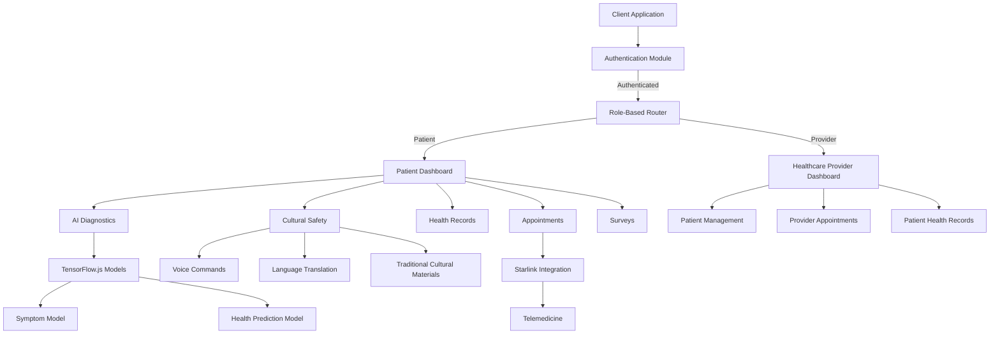
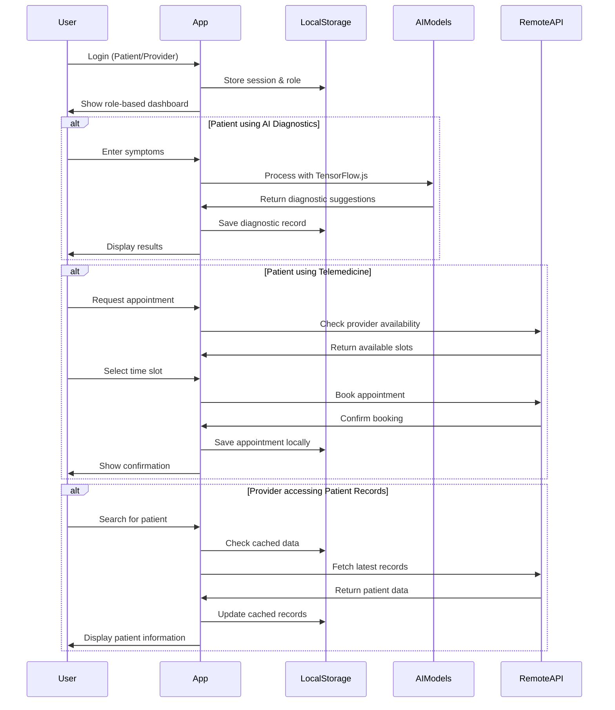
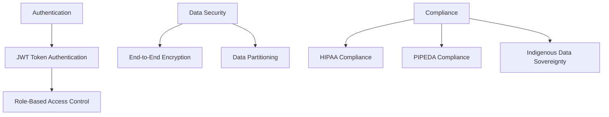

# KweCare Architecture Overview

## System Architecture Diagram

## Component Architecture

KweCare is built with a modular architecture that ensures separation of concerns and enables offline functionality where needed. The application is structured as follows:

### 1. Core Application Layers

| Layer | Description | Key Components |
|-------|-------------|----------------|
| **UI Layer** | User interface components built with React and Tailwind CSS | Header, Footer, Cards, Forms |
| **Routing Layer** | Path-based navigation with role-based access control | BrowserRouter, Protected Routes |
| **State Management** | Context API for global state, React Query for data fetching | AuthContext, QueryClient |
| **Business Logic** | Feature-specific logic and integrations | Authentication, AI Models, Telemedicine |
| **Storage Layer** | Local storage for offline functionality | Profile data, Health records, AI models |

### 2. Feature Modules

#### Authentication Module
- Login/Signup with role selection (Patient/Provider)
- Session management with local/session storage
- Role-based routing and permissions

#### Patient Dashboard Module
- Overview with health metrics and upcoming appointments
- Context-aware navigation between health features
- Voice command integration for accessibility

#### Healthcare Provider Module
- Patient management and search
- Appointment scheduling
- Access to patient health records
- Treatment planning

#### AI Diagnostics Module
- Offline-capable TensorFlow.js models
- Symptom checker with natural language processing
- Health predictions based on vitals and metrics
- AI Insights with personalized recommendations

#### Cultural Safety Module
- Indigenous language selection
- Voice commands in native languages
- Traditional knowledge integration
- Culturally appropriate health guidance

#### Telemedicine Module
- Low-bandwidth video consultation
- Starlink API integration
- Store-and-forward capabilities for offline scenarios
- Secure messaging with providers

### 3. Data Flow Architecture

### 4. Offline Capability Architecture

KweCare implements a sophisticated offline-first approach using:

1. **Local Data Persistence**
   - Patient records cached in localStorage/sessionStorage
   - IndexedDB for larger health datasets

2. **TensorFlow.js for Client-Side AI**
   - Models loaded and run entirely in the browser
   - Simplified fallback models for lower-end devices
   - Periodic model updates when online

3. **Network-Aware Sync**
   - Background synchronization when connectivity returns
   - Queue-based operations for pending changes
   - Conflict resolution strategies

4. **Progressive Enhancement**
   - Core features work without connectivity
   - Enhanced features activate when online
   - Graceful degradation when resources are limited

### 5. Security Architecture

### 6. Cultural Integration Architecture

Cultural safety is integrated throughout the application architecture:

1. **Language Layer**
   - UI components support indigenous languages
   - Natural language processing for voice commands
   - Cultural context preservation in translations

2. **Knowledge Repository**
   - Traditional medicine database
   - Cultural protocols and practices
   - Elder wisdom integration

3. **Community Governance**
   - Data sovereignty principles
   - Community-led feature prioritization
   - Ethical AI development guidelines

## Technology Stack

| Layer | Technologies |
|-------|--------------|
| **Frontend Framework** | React, TypeScript |
| **UI Components** | Radix UI, Shadcn UI, TailwindCSS |
| **Routing** | React Router |
| **State Management** | Context API, React Query |
| **AI/ML** | TensorFlow.js |
| **Offline Storage** | localStorage, IndexedDB |
| **Visualization** | Recharts |
| **Form Handling** | React Hook Form, Zod |
| **Notifications** | Sonner Toast |
| **Build & Bundling** | Vite | 