# KweCare Cultural Integration Framework

This document outlines KweCare's comprehensive approach to cultural integration, ensuring that the application respectfully incorporates Indigenous perspectives, languages, and healing traditions.

## Cultural Safety Framework

## 1. Indigenous Language Integration

KweCare provides a multilingual experience that centers Indigenous languages at its core, not as an afterthought.

### Supported Languages

| Language | Dialect Support | UI Coverage | Terminology | Voice Support |
|----------|----------------|------------|-------------|---------------|
| Cree | Plains, Woods, Swampy | 100% | Medical + Traditional | Full |
| Inuktitut | Regional variants | 100% | Medical + Traditional | Full |
| Ojibwe | Southern, Northwestern | 100% | Medical + Traditional | Full |
| Michif | Standard | 100% | Medical + Traditional | Partial |
| Denesuline | Standard | 100% | Medical + Traditional | Partial |
| English | Canadian | 100% | Medical + Indigenous | Full |

### Language Implementation

KweCare's language implementation includes:

- **Dynamic Language Switching**: Change language without losing context
- **Culturally Appropriate Terminology**: Medical concepts explained in culturally relevant ways
- **Indigenous Fonts**: Support for syllabic writing systems
- **Language-Specific Media**: Audio and video content in each language
- **Community-Validated Translations**: All content reviewed by fluent speakers and knowledge keepers

## 2. Traditional Knowledge Integration

KweCare respectfully integrates traditional Indigenous health knowledge alongside Western medical approaches.

### Knowledge Governance Model

### Attribution and Protection

KweCare implements a detailed attribution system for all traditional knowledge:

- **Source Community**: Clear identification of knowledge source
- **Knowledge Keepers**: Attribution to individual Elders/Knowledge Keepers where permitted
- **Usage Conditions**: Clear explanation of appropriate context for knowledge
- **Digital Protection**: Controls on sharing, copying, and distribution based on community guidelines
- **Revocability**: Communities can withdraw or modify shared knowledge at any time

## 3. Cultural User Experience Design

### Cultural Design Elements

KweCare incorporates culturally responsive design elements throughout:

1. **Visual Language**
   - Symbols and iconography from Indigenous visual traditions
   - Color palettes inspired by natural materials and traditional art
   - Images representing diverse Indigenous communities and healers
   - Appropriate use of cultural symbols with permission

2. **Interaction Patterns**
   - Circle-based interfaces reflecting medicine wheel concepts
   - Storytelling approaches to information presentation
   - Seasonal awareness in content presentation
   - Elder-centered accessibility features

3. **Community-Led Design Principles**
   - Design workshops with community members
   - Iterative testing with Elders and youth
   - Balance of innovation and tradition
   - Respect for cultural protocols in all designs

## 4. Voice Interaction System

### Voice Features

KweCare's voice interaction system includes:

- **Multilingual Command Recognition**: Voice commands in all supported languages
- **Natural Language Understanding**: Contextual interpretation of requests
- **Cultural Expression Recognition**: Understanding of cultural expressions and references
- **Dialect Adaptation**: Learning individual speech patterns and dialects
- **Elder-Friendly Interaction**: Adjustable speech rate and simplified command options
- **Context-Aware Responses**: Responses that respect cultural protocols and relationships

## 5. Data Sovereignty Implementation

KweCare implements the principles of Indigenous data sovereignty throughout its design:

### OCAP® Implementation 

KweCare follows the First Nations Information Governance Centre's OCAP® principles:

1. **Ownership**
   - Individuals and communities retain ownership of their health data
   - Traditional knowledge belongs to communities, not the application
   - Explicit recognition of data as cultural resource

2. **Control**
   - Granular permissions for data sharing and use
   - Community-level controls for aggregate data
   - Advisory council involvement in data governance

3. **Access**
   - Transparent access logs for all health information
   - Community approval process for research access
   - Individual right to access all personal data

4. **Possession**
   - Options for local data storage in community
   - Community-owned server infrastructure options
   - Encryption and security controls managed by community

## 6. Cultural Safety in Healthcare Delivery

### Healthcare Provider Support

KweCare provides healthcare providers with cultural safety tools:

1. **Cultural Context Information**
   - Community-specific cultural protocols and practices
   - Historical context for healthcare interactions
   - Traditional approaches to specific health conditions

2. **Communication Support**
   - Translation assistance for medical terminology
   - Cultural interpretation of symptoms and descriptions
   - Guidance on appropriate communication styles

3. **Decision Support**
   - Integration of traditional and Western approaches
   - Community preference information when available
   - Cultural safety considerations in treatment plans

## 7. Community-Led Development Process

### Development Methodology

KweCare follows a community-led development process:

1. **Indigenous Advisory Council**
   - Representatives from partner communities
   - Elders and knowledge keepers
   - Indigenous healthcare professionals
   - Technical advisors from Indigenous communities

2. **Co-Design Workshops**
   - Regular design sessions in communities
   - Multi-generational participation
   - Balanced representation of genders and roles
   - Appropriate cultural protocols observed

3. **Community Testing Cycles**
   - Field testing in actual community settings
   - Realistic connectivity and device conditions
   - Elder and youth user testing
   - Iterative improvement based on feedback

## 8. Cultural Adaptation Framework

KweCare is designed to be adaptable to different Indigenous communities while maintaining core functionality:

### Community-Specific Adaptations

KweCare can be adapted for specific communities through:

1. **Language Customization**
   - Community-specific dialect support
   - Local terminology and expressions
   - Region-specific medical vocabulary

2. **Knowledge Base Adaptation**
   - Local traditional medicine information
   - Community healing resources and contacts
   - Seasonal and geographical health guidance

3. **Visual and UX Customization**
   - Community-specific symbols and imagery
   - Local color preferences and visual traditions
   - Navigation adapted to community structure

4. **Process Adaptation**
   - Alignment with local healthcare delivery
   - Integration with community health workers
   - Support for community-specific protocols

## 9. Cultural Safety Measurement

KweCare implements a comprehensive evaluation framework to measure cultural safety effectiveness:

### Key Performance Indicators

KweCare measures cultural safety through:

1. **User Experience Metrics**
   - Language preference selection rates
   - Voice interface usage by language
   - Traditional knowledge resource access
   - Cultural feature engagement

2. **Clinical Integration Metrics**
   - Appointment completion rates
   - Care plan adherence
   - Follow-up engagement
   - Health outcome improvements

3. **Community Impact Metrics**
   - Community adoption rates
   - User satisfaction by demographic
   - Knowledge keeper engagement
   - Community health worker integration

## 10. Future Cultural Integration Roadmap

```mermaid
graph TD
    subgraph "Future Development"
        Future[Future Roadmap] --> LangExp[Language Expansion]
        Future --> Knowledge[Knowledge Systems]
        Future --> InterGen[Intergenerational Features]
        Future --> ArtsInt[Arts Integration]
        
        LangExp --> MoreLang[Additional Languages]
        LangExp --> DialectRef[Dialect Refinement]
        LangExp --> SpeechAdv[Advanced Speech]
        
        Knowledge --> SeasonalKnow[Seasonal Knowledge]
        Knowledge --> MedicineInt[Medicine Integration]
        Knowledge --> StoryInt[Storytelling]
        
        InterGen --> YouthElder[Youth-Elder Connection]
        InterGen --> KnowledgeTransfer[Knowledge Transfer]
        
        ArtsInt --> Music[Music Therapy]
        ArtsInt --> Art[Visual Arts]
        ArtsInt --> Story[Digital Storytelling]
    end
```

KweCare's future cultural integration plans include:

1. **Expanded Language Support**
   - Additional Indigenous languages
   - Advanced dialect support
   - Enhanced voice interaction capabilities

2. **Knowledge System Integration**
   - Deeper integration of seasonal health knowledge
   - More extensive traditional medicine documentation
   - Community storytelling as health education

3. **Intergenerational Features**
   - Youth-Elder connection tools
   - Knowledge transfer facilitation
   - Cultural continuity support

4. **Environmental Integration**
   - Land-based healing connections
   - Seasonal health recommendations
   - Environmental health monitoring 