# KweCare Data Flow & Security Architecture

This document outlines the data flow and security architecture of the KweCare application, detailing how information moves through the system and the security measures in place to protect sensitive health data.

## Data Flow Overview

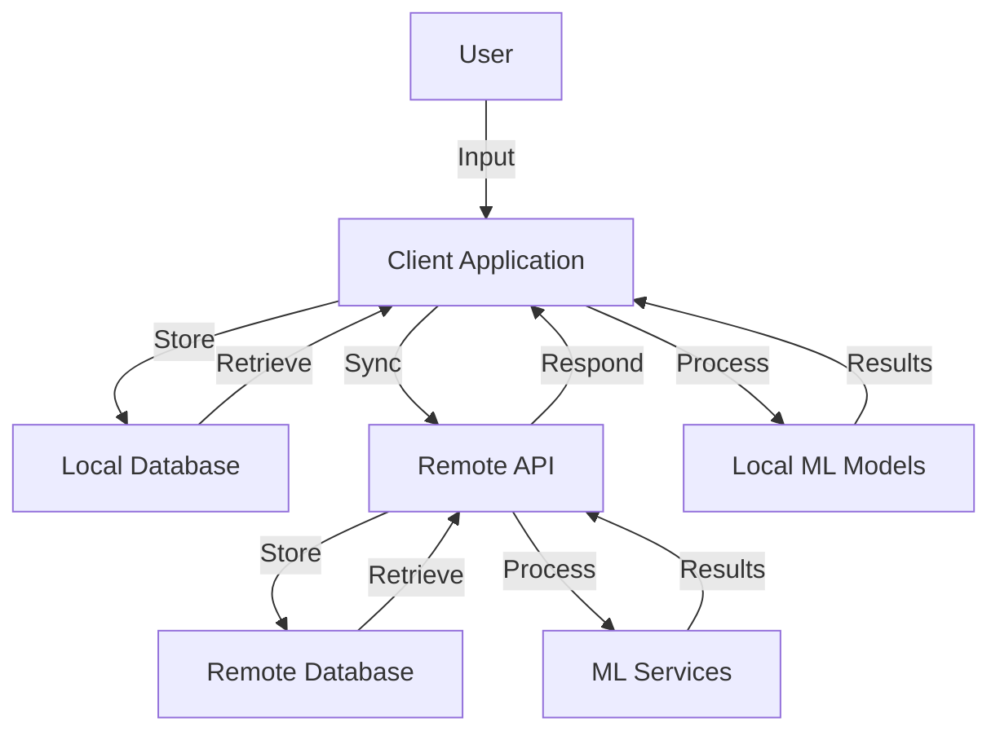
```mermaid
graph TD
    User[User] --> |Input| Client[Client Application]
    Client --> |Store| LocalDB[Local Database]
    Client --> |Sync| API[Remote API]
    API --> |Store| RemoteDB[Remote Database]
    API --> |Process| ML[ML Services]
    Client --> |Process| LocalML[Local ML Models]
    
    LocalDB --> |Retrieve| Client
    RemoteDB --> |Retrieve| API
    API --> |Respond| Client
    LocalML --> |Results| Client
    ML --> |Results| API
```

## Detailed Data Flows

### 1. Authentication Flow

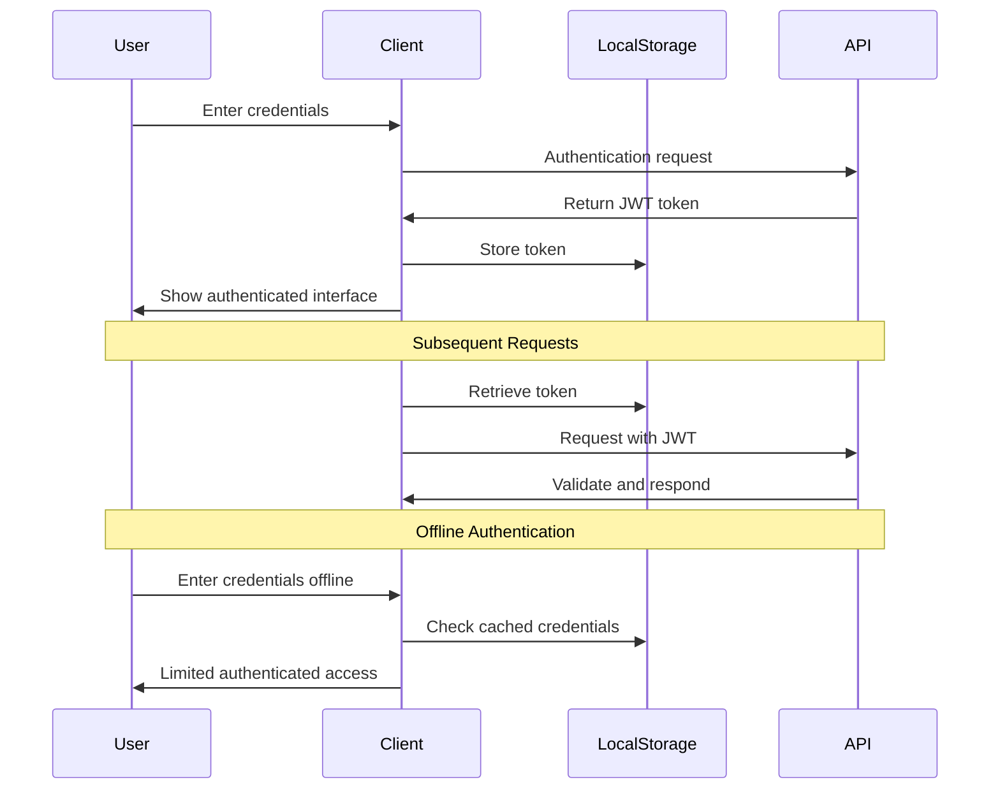
```mermaid
sequenceDiagram
    participant User
    participant Client
    participant LocalStorage
    participant API
    
    User->>Client: Enter credentials
    Client->>API: Authentication request
    API->>Client: Return JWT token
    Client->>LocalStorage: Store token
    Client->>User: Show authenticated interface
    
    Note over User,API: Subsequent Requests
    Client->>LocalStorage: Retrieve token
    Client->>API: Request with JWT
    API->>Client: Validate and respond
    
    Note over User,API: Offline Authentication
    User->>Client: Enter credentials offline
    Client->>LocalStorage: Check cached credentials
    Client->>User: Limited authenticated access
```

### 2. Patient Health Record Flow

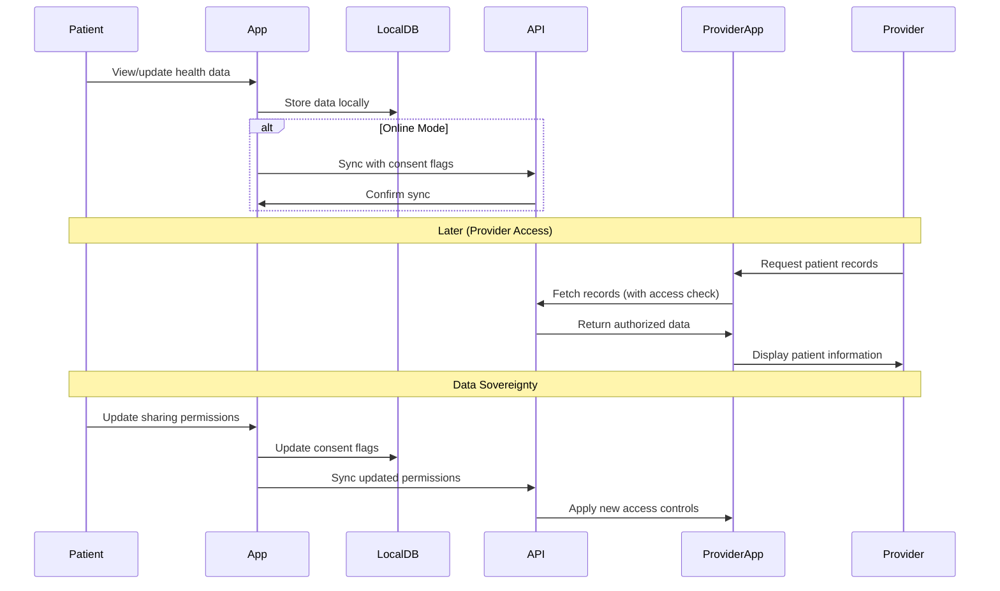
```mermaid
sequenceDiagram
    participant Patient
    participant App
    participant LocalDB
    participant API
    participant ProviderApp
    participant Provider
    
    Patient->>App: View/update health data
    App->>LocalDB: Store data locally
    
    alt Online Mode
        App->>API: Sync with consent flags
        API->>App: Confirm sync
    end
    
    Note over Patient,Provider: Later (Provider Access)
    
    Provider->>ProviderApp: Request patient records
    ProviderApp->>API: Fetch records (with access check)
    API->>ProviderApp: Return authorized data
    ProviderApp->>Provider: Display patient information
    
    Note over Patient,Provider: Data Sovereignty
    
    Patient->>App: Update sharing permissions
    App->>LocalDB: Update consent flags
    App->>API: Sync updated permissions
    API->>ProviderApp: Apply new access controls
```

### 3. AI Diagnostics Flow

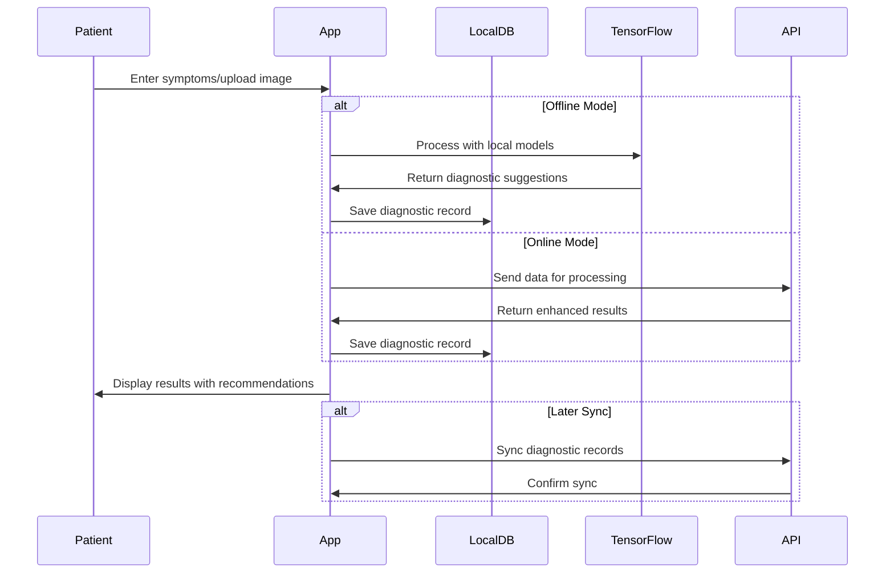
```mermaid
sequenceDiagram
    participant Patient
    participant App
    participant LocalDB
    participant TensorFlow
    participant API
    
    Patient->>App: Enter symptoms/upload image
    
    alt Offline Mode
        App->>TensorFlow: Process with local models
        TensorFlow->>App: Return diagnostic suggestions
        App->>LocalDB: Save diagnostic record
    else Online Mode
        App->>API: Send data for processing
        API->>App: Return enhanced results
        App->>LocalDB: Save diagnostic record
    end
    
    App->>Patient: Display results with recommendations
    
    alt Later Sync
        App->>API: Sync diagnostic records
        API->>App: Confirm sync
    end
```

### 4. Telemedicine Appointment Flow

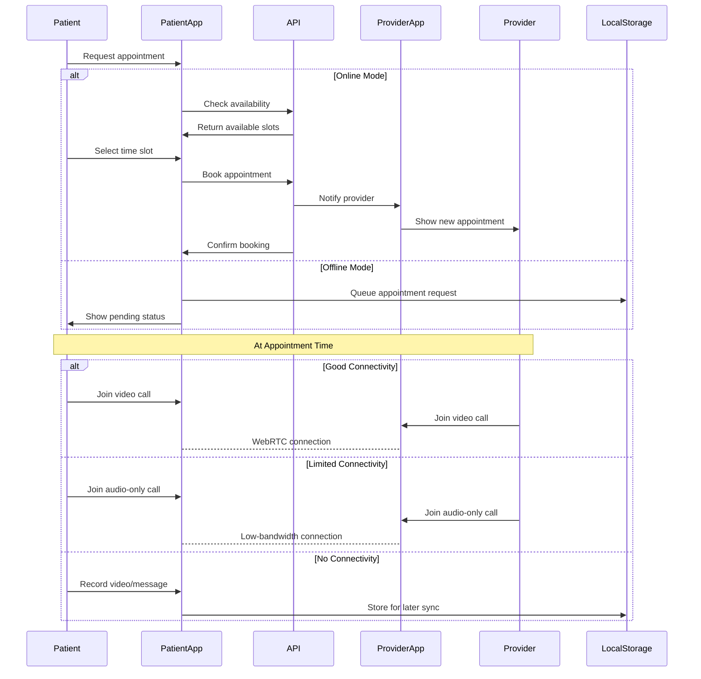
```mermaid
sequenceDiagram
    participant Patient
    participant PatientApp
    participant API
    participant ProviderApp
    participant Provider
    
    Patient->>PatientApp: Request appointment
    
    alt Online Mode
        PatientApp->>API: Check availability
        API->>PatientApp: Return available slots
        Patient->>PatientApp: Select time slot
        PatientApp->>API: Book appointment
        API->>ProviderApp: Notify provider
        ProviderApp->>Provider: Show new appointment
        API->>PatientApp: Confirm booking
    else Offline Mode
        PatientApp->>LocalStorage: Queue appointment request
        PatientApp->>Patient: Show pending status
    end
    
    Note over Patient,Provider: At Appointment Time
    
    alt Good Connectivity
        Patient->>PatientApp: Join video call
        Provider->>ProviderApp: Join video call
        PatientApp-->ProviderApp: WebRTC connection
    else Limited Connectivity
        Patient->>PatientApp: Join audio-only call
        Provider->>ProviderApp: Join audio-only call
        PatientApp-->ProviderApp: Low-bandwidth connection
    else No Connectivity
        Patient->>PatientApp: Record video/message
        PatientApp->>LocalStorage: Store for later sync
    end
```

### 5. Cultural Knowledge Integration Flow

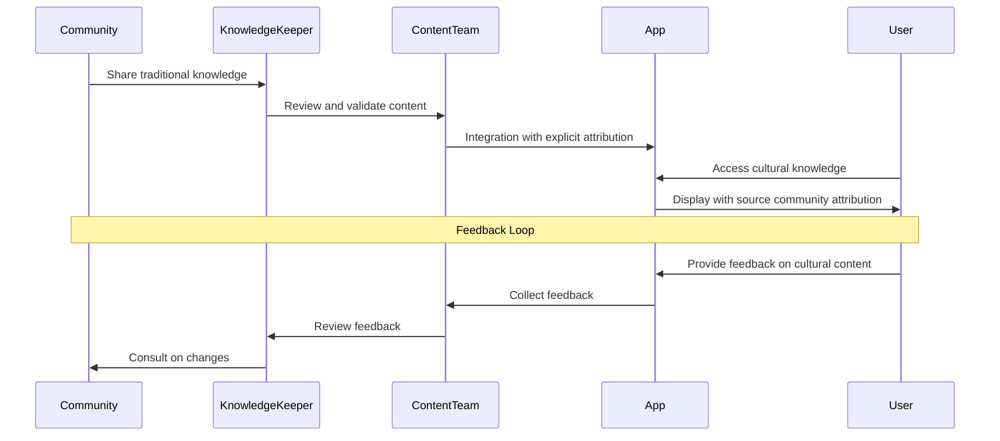
```mermaid
sequenceDiagram
    participant Community
    participant KnowledgeKeeper
    participant ContentTeam
    participant App
    participant User
    
    Community->>KnowledgeKeeper: Share traditional knowledge
    KnowledgeKeeper->>ContentTeam: Review and validate content
    ContentTeam->>App: Integration with explicit attribution
    
    User->>App: Access cultural knowledge
    App->>User: Display with source community attribution
    
    Note over Community,User: Feedback Loop
    User->>App: Provide feedback on cultural content
    App->>ContentTeam: Collect feedback
    ContentTeam->>KnowledgeKeeper: Review feedback
    KnowledgeKeeper->>Community: Consult on changes
```

### 6. Text-to-Speech Accessibility Flow

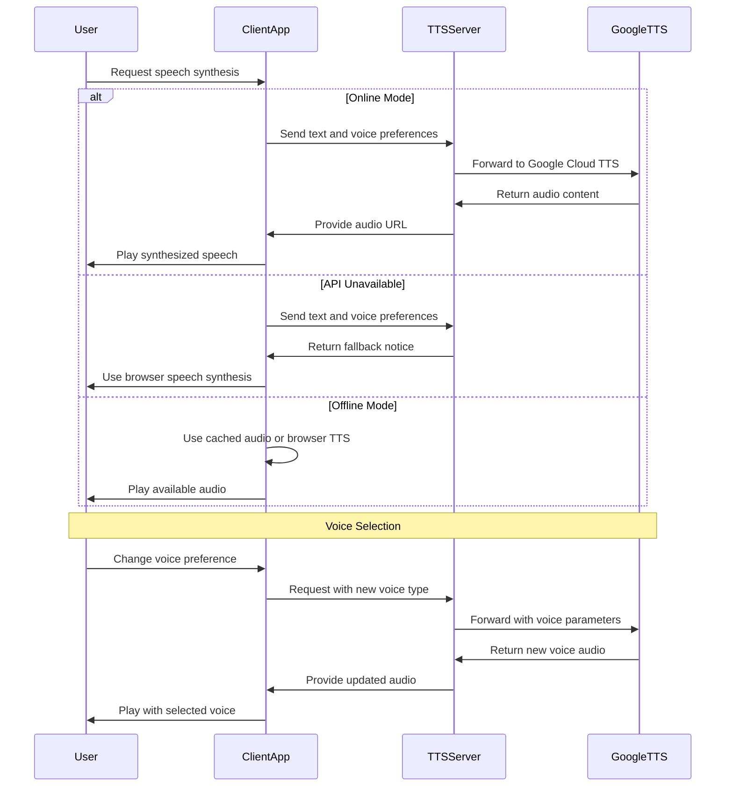
```mermaid
sequenceDiagram
    participant User
    participant ClientApp
    participant TTSServer
    participant GoogleTTS
    
    User->>ClientApp: Request speech synthesis
    
    alt Online Mode
        ClientApp->>TTSServer: Send text and voice preferences
        TTSServer->>GoogleTTS: Forward to Google Cloud TTS
        GoogleTTS->>TTSServer: Return audio content
        TTSServer->>ClientApp: Provide audio URL
        ClientApp->>User: Play synthesized speech
    else API Unavailable
        ClientApp->>TTSServer: Send text and voice preferences
        TTSServer->>ClientApp: Return fallback notice
        ClientApp->>User: Use browser speech synthesis
    else Offline Mode
        ClientApp->>ClientApp: Use cached audio or browser TTS
        ClientApp->>User: Play available audio
    end
    
    Note over User,GoogleTTS: Voice Selection
    User->>ClientApp: Change voice preference
    ClientApp->>TTSServer: Request with new voice type
    TTSServer->>GoogleTTS: Forward with voice parameters
    GoogleTTS->>TTSServer: Return new voice audio
    TTSServer->>ClientApp: Provide updated audio
    ClientApp->>User: Play with selected voice
```

## Data Storage Architecture

KweCare implements a tiered storage architecture to ensure data availability while respecting sovereignty:

### 1. Local Storage (Client-Side)

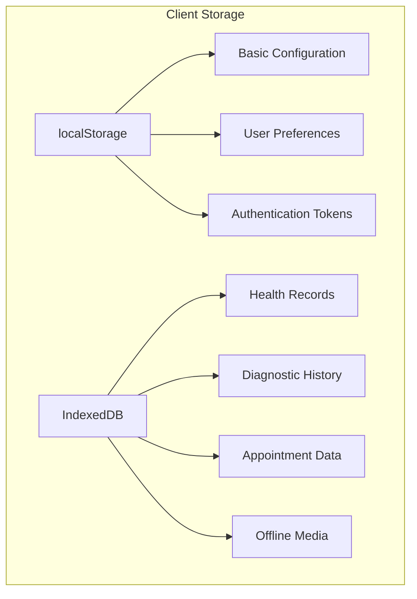
```mermaid
graph TD
    subgraph "Client Storage"
        LS[localStorage] --> BasicConfig[Basic Configuration]
        LS --> UserPrefs[User Preferences]
        LS --> AuthToken[Authentication Tokens]
        
        IDB[IndexedDB] --> HealthRecords[Health Records]
        IDB --> DiagnosticHistory[Diagnostic History]
        IDB --> AppointmentData[Appointment Data]
        IDB --> OfflineMedia[Offline Media]
    end
```

| Storage Type | Purpose | Implementation | Encryption |
|--------------|---------|----------------|------------|
| localStorage | User preferences, UI state, auth tokens | Browser API | JWT only |
| IndexedDB | Patient records, diagnostic data, appointment history | Dexie.js wrapper | AES-256 |
| Cache Storage | AI models, static assets, UI resources | Workbox/Service Worker | Not required |

### 2. Remote Storage (Server-Side)

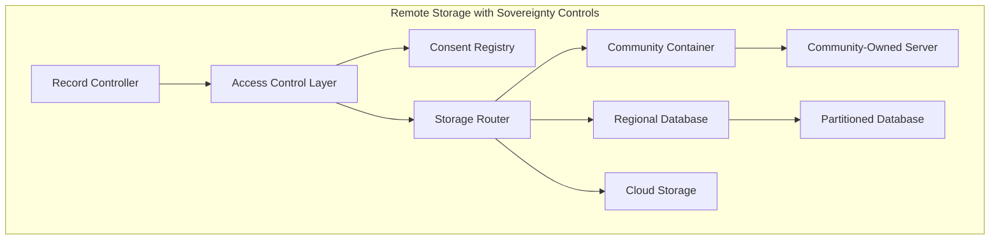
```mermaid
graph TD
    subgraph "Remote Storage with Sovereignty Controls"
        RC[Record Controller] --> AccessCheck[Access Control Layer]
        AccessCheck --> ConsentRegistry[Consent Registry]
        AccessCheck --> StorageRouter[Storage Router]
        
        StorageRouter --> CommContainer[Community Container]
        StorageRouter --> RegionalDB[Regional Database]
        StorageRouter --> CloudStorage[Cloud Storage]
        
        CommContainer --> LocalServer[Community-Owned Server]
        RegionalDB --> PartitionedDB[Partitioned Database]
    end
```

## Security Architecture

### 1. Data Protection Layers

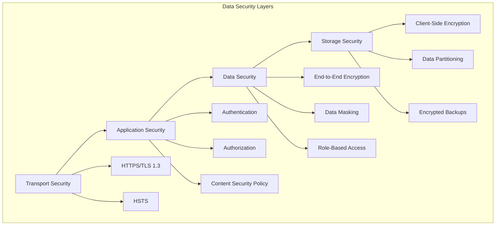
```mermaid
graph TD
    subgraph "Data Security Layers"
        Transport[Transport Security] --> AppSec[Application Security]
        AppSec --> DataSec[Data Security]
        DataSec --> StorageSec[Storage Security]
        
        Transport --> HTTPS[HTTPS/TLS 1.3]
        Transport --> HSTS[HSTS]
        
        AppSec --> Auth[Authentication]
        AppSec --> AuthZ[Authorization]
        AppSec --> CSP[Content Security Policy]
        
        DataSec --> Encrypt[End-to-End Encryption]
        DataSec --> Masking[Data Masking]
        DataSec --> RBAC[Role-Based Access]
        
        StorageSec --> ClientEnc[Client-Side Encryption]
        StorageSec --> Partition[Data Partitioning]
        StorageSec --> Backup[Encrypted Backups]
    end
```

### 2. Consent Management Framework

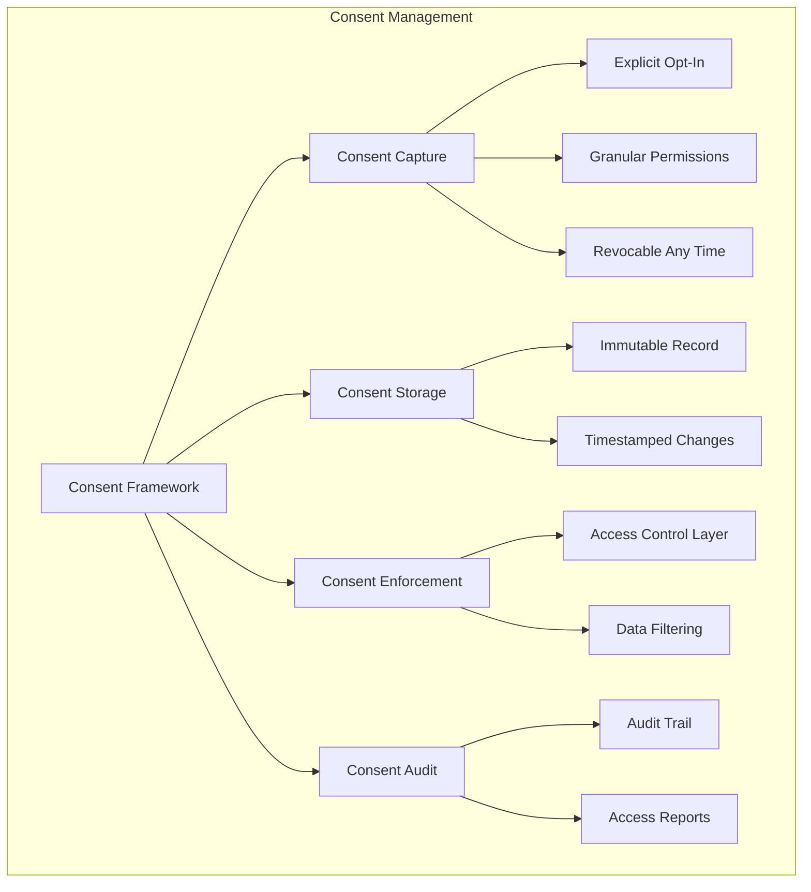
```mermaid
graph TD
    subgraph "Consent Management"
        Consent[Consent Framework] --> Capture[Consent Capture]
        Consent --> Storage[Consent Storage]
        Consent --> Enforce[Consent Enforcement]
        Consent --> Audit[Consent Audit]
        
        Capture --> Explicit[Explicit Opt-In]
        Capture --> Granular[Granular Permissions]
        Capture --> Revocable[Revocable Any Time]
        
        Storage --> Immutable[Immutable Record]
        Storage --> Timestamped[Timestamped Changes]
        
        Enforce --> AccessControl[Access Control Layer]
        Enforce --> DataFilter[Data Filtering]
        
        Audit --> Trail[Audit Trail]
        Audit --> Reports[Access Reports]
    end
```

### 3. Compliance Framework Integration

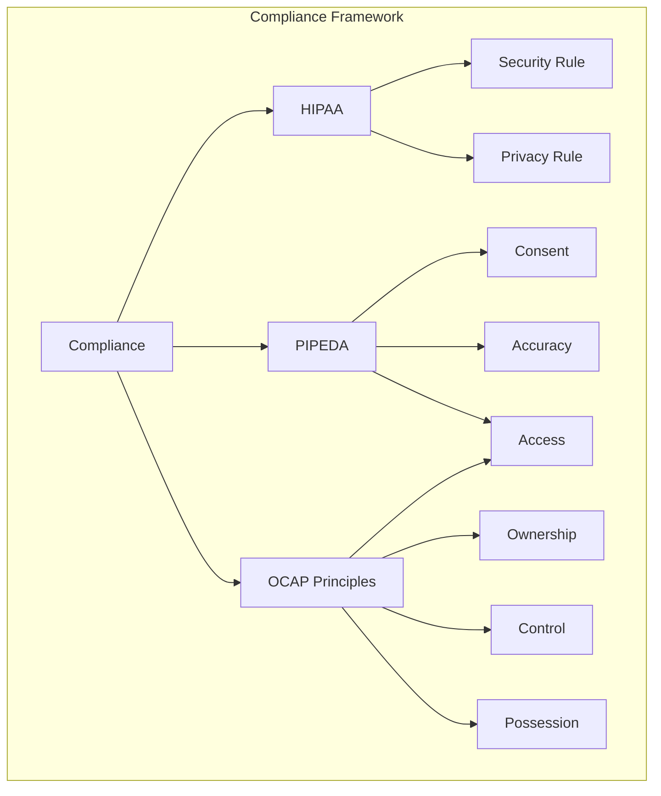
```mermaid
graph TD
    subgraph "Compliance Framework"
        Compliance --> HIPAA[HIPAA]
        Compliance --> PIPEDA[PIPEDA]
        Compliance --> OCAP[OCAP Principles]
        
        HIPAA --> Security[Security Rule]
        HIPAA --> Privacy[Privacy Rule]
        
        PIPEDA --> Consent[Consent]
        PIPEDA --> Accuracy[Accuracy]
        PIPEDA --> Access[Access]
        
        OCAP --> Ownership[Ownership]
        OCAP --> Control[Control]
        OCAP --> Access[Access]
        OCAP --> Possession[Possession]
    end
```

## Offline-Online Synchronization

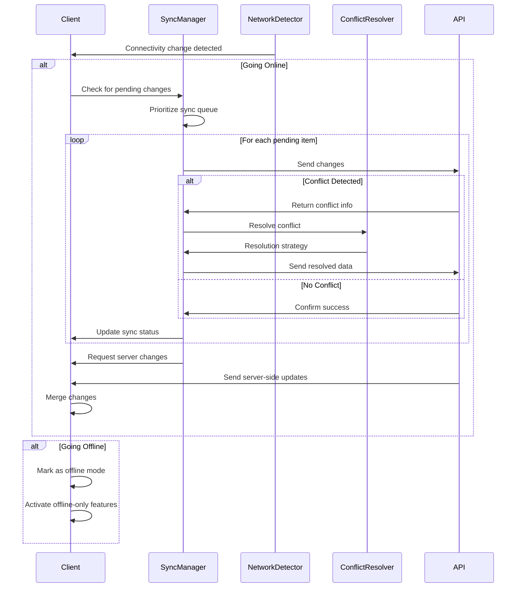
```mermaid
sequenceDiagram
    participant Client
    participant SyncManager
    participant NetworkDetector
    participant ConflictResolver
    participant API
    
    NetworkDetector->>Client: Connectivity change detected
    
    alt Going Online
        Client->>SyncManager: Check for pending changes
        SyncManager->>SyncManager: Prioritize sync queue
        
        loop For each pending item
            SyncManager->>API: Send changes
            alt Conflict Detected
                API->>SyncManager: Return conflict info
                SyncManager->>ConflictResolver: Resolve conflict
                ConflictResolver->>SyncManager: Resolution strategy
                SyncManager->>API: Send resolved data
            else No Conflict
                API->>SyncManager: Confirm success
            end
            SyncManager->>Client: Update sync status
        end
        
        SyncManager->>Client: Request server changes
        API->>Client: Send server-side updates
        Client->>Client: Merge changes
    end
    
    alt Going Offline
        Client->>Client: Mark as offline mode
        Client->>Client: Activate offline-only features
    end
```

## Data Privacy Controls

KweCare implements fine-grained data privacy controls that allow users to specify exactly what data is shared and with whom:

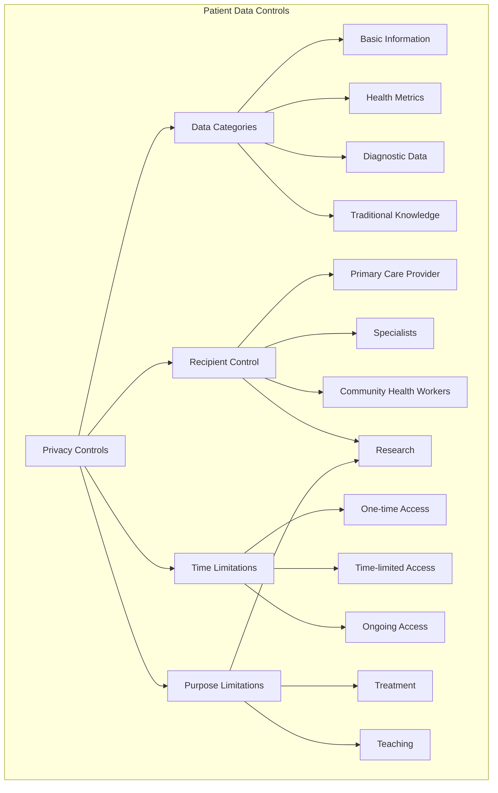
```mermaid
graph TD
    subgraph "Patient Data Controls"
        PC[Privacy Controls] --> Categories[Data Categories]
        PC --> Audience[Recipient Control]
        PC --> Duration[Time Limitations]
        PC --> Purpose[Purpose Limitations]
        
        Categories --> BasicInfo[Basic Information]
        Categories --> HealthMetrics[Health Metrics]
        Categories --> DiagnosticData[Diagnostic Data]
        Categories --> TradKnowledge[Traditional Knowledge]
        
        Audience --> PrimaryCare[Primary Care Provider]
        Audience --> Specialists[Specialists]
        Audience --> Community[Community Health Workers]
        Audience --> Research[Anonymized Research]
        
        Duration --> OneTime[One-time Access]
        Duration --> TimeBound[Time-limited Access]
        Duration --> Ongoing[Ongoing Access]
        
        Purpose --> Treatment[Treatment]
        Purpose --> Research[Research]
        Purpose --> Teaching[Teaching]
    end
```

## Ethical AI Data Handling

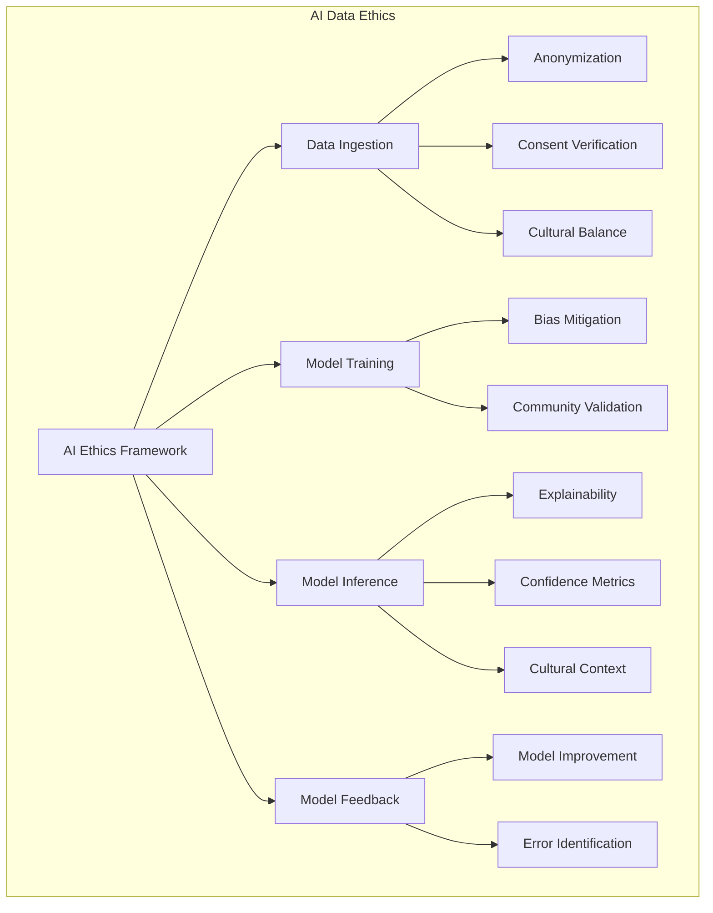
```mermaid
graph TD
    subgraph "AI Data Ethics"
        AIEthics[AI Ethics Framework] --> DataIngest[Data Ingestion]
        AIEthics --> Training[Model Training]
        AIEthics --> Inference[Model Inference]
        AIEthics --> Feedback[Model Feedback]
        
        DataIngest --> Anonymize[Anonymization]
        DataIngest --> Consent[Consent Verification]
        DataIngest --> Balance[Cultural Balance]
        
        Training --> BiasControl[Bias Mitigation]
        Training --> Validation[Community Validation]
        
        Inference --> Explainable[Explainability]
        Inference --> Confidence[Confidence Metrics]
        Inference --> Context[Cultural Context]
        
        Feedback --> Improvement[Model Improvement]
        Feedback --> ErrorID[Error Identification]
    end
```

## Emergency Access Protocol

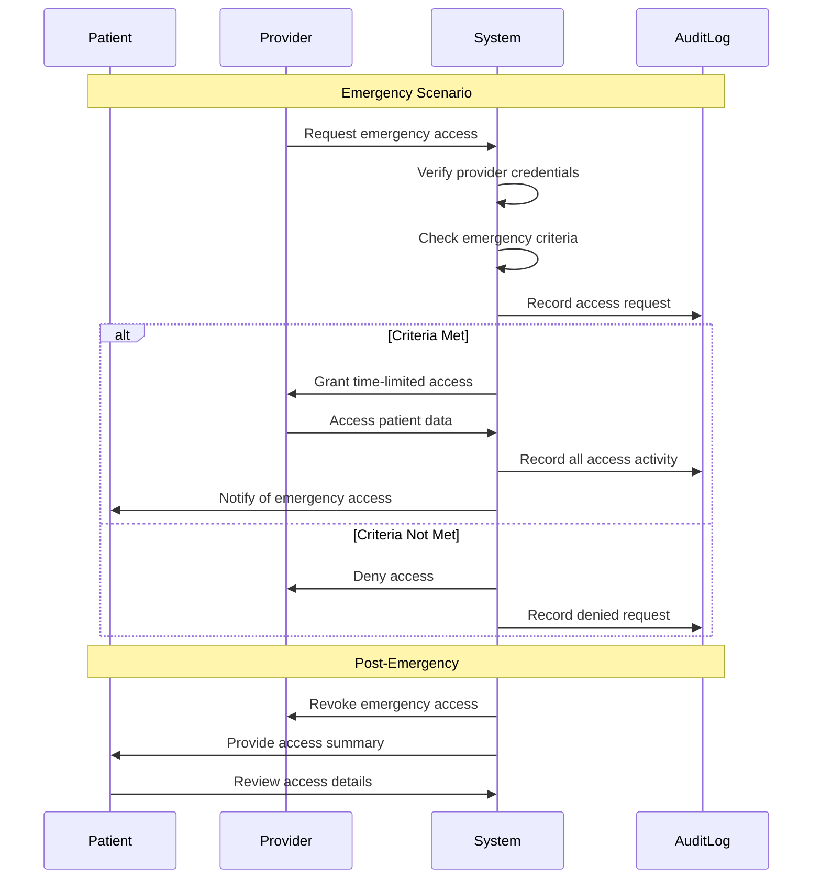
```mermaid
sequenceDiagram
    participant Patient
    participant Provider
    participant System
    participant AuditLog
    
    Note over Patient,AuditLog: Emergency Scenario
    
    Provider->>System: Request emergency access
    System->>System: Verify provider credentials
    System->>System: Check emergency criteria
    System->>AuditLog: Record access request
    
    alt Criteria Met
        System->>Provider: Grant time-limited access
        Provider->>System: Access patient data
        System->>AuditLog: Record all access activity
        System->>Patient: Notify of emergency access
    else Criteria Not Met
        System->>Provider: Deny access
        System->>AuditLog: Record denied request
    end
    
    Note over Patient,AuditLog: Post-Emergency
    
    System->>Provider: Revoke emergency access
    System->>Patient: Provide access summary
    Patient->>System: Review access details
```

## Data Sovereignty Implementation

KweCare's data sovereignty model follows the OCAP® principles (Ownership, Control, Access, Possession) developed by the First Nations Information Governance Centre:

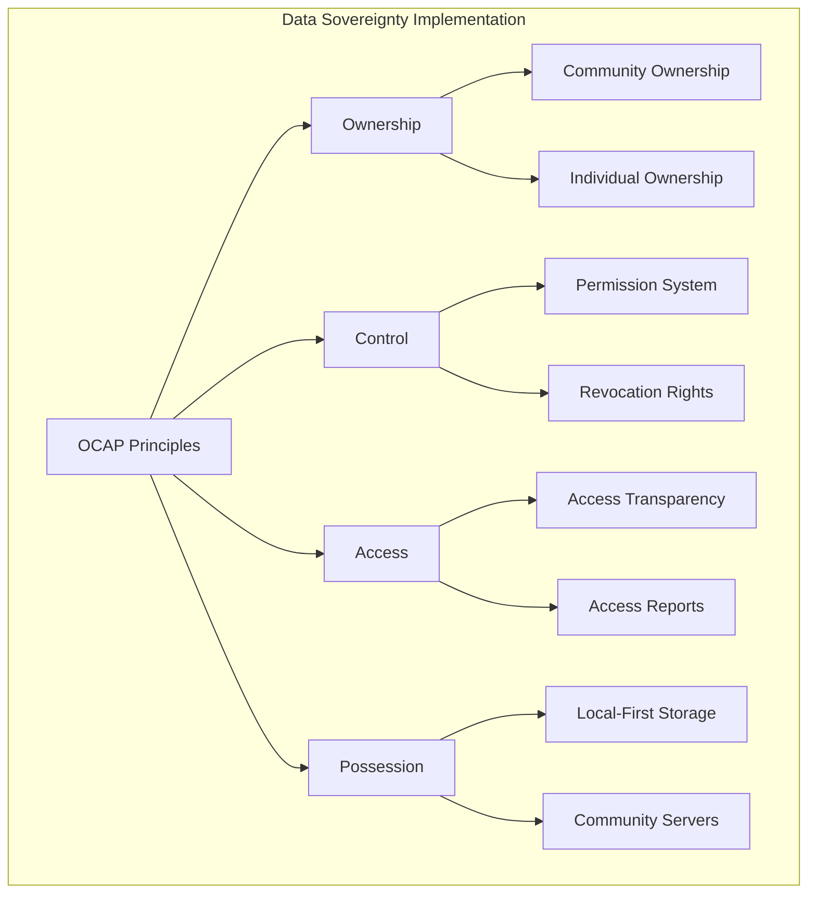
```mermaid
graph TD
    subgraph "Data Sovereignty Implementation"
        OCAP[OCAP Principles] --> Own[Ownership]
        OCAP --> Ctrl[Control]
        OCAP --> Acc[Access]
        OCAP --> Poss[Possession]
        
        Own --> CommOwn[Community Ownership]
        Own --> IndOwn[Individual Ownership]
        
        Ctrl --> Permission[Permission System]
        Ctrl --> Revocation[Revocation Rights]
        
        Acc --> Transparency[Access Transparency]
        Acc --> Reports[Access Reports]
        
        Poss --> LocalFirst[Local-First Storage]
        Poss --> CommServers[Community Servers]
    end
```

## Data Residency Options

KweCare offers multiple data residency options to support community data sovereignty:

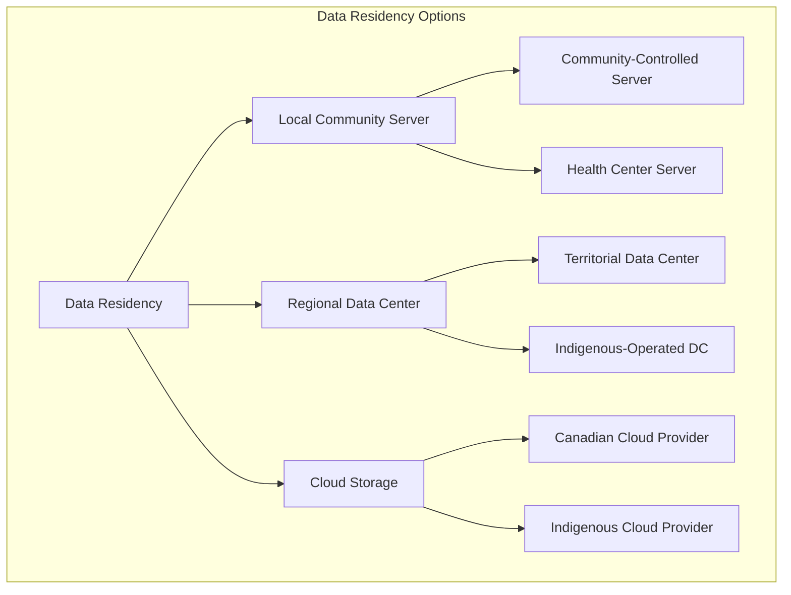
```mermaid
graph TD
    subgraph "Data Residency Options"
        Residency[Data Residency] --> Local[Local Community Server]
        Residency --> Regional[Regional Data Center]
        Residency --> Cloud[Cloud Storage]
        
        Local --> CommServ[Community-Controlled Server]
        Local --> HealthCenter[Health Center Server]
        
        Regional --> TerritorialDC[Territorial Data Center]
        Regional --> IndigenousDC[Indigenous-Operated DC]
        
        Cloud --> CanCloud[Canadian Cloud Provider]
        Cloud --> SovCloud[Indigenous Cloud Provider]
    end
``` 