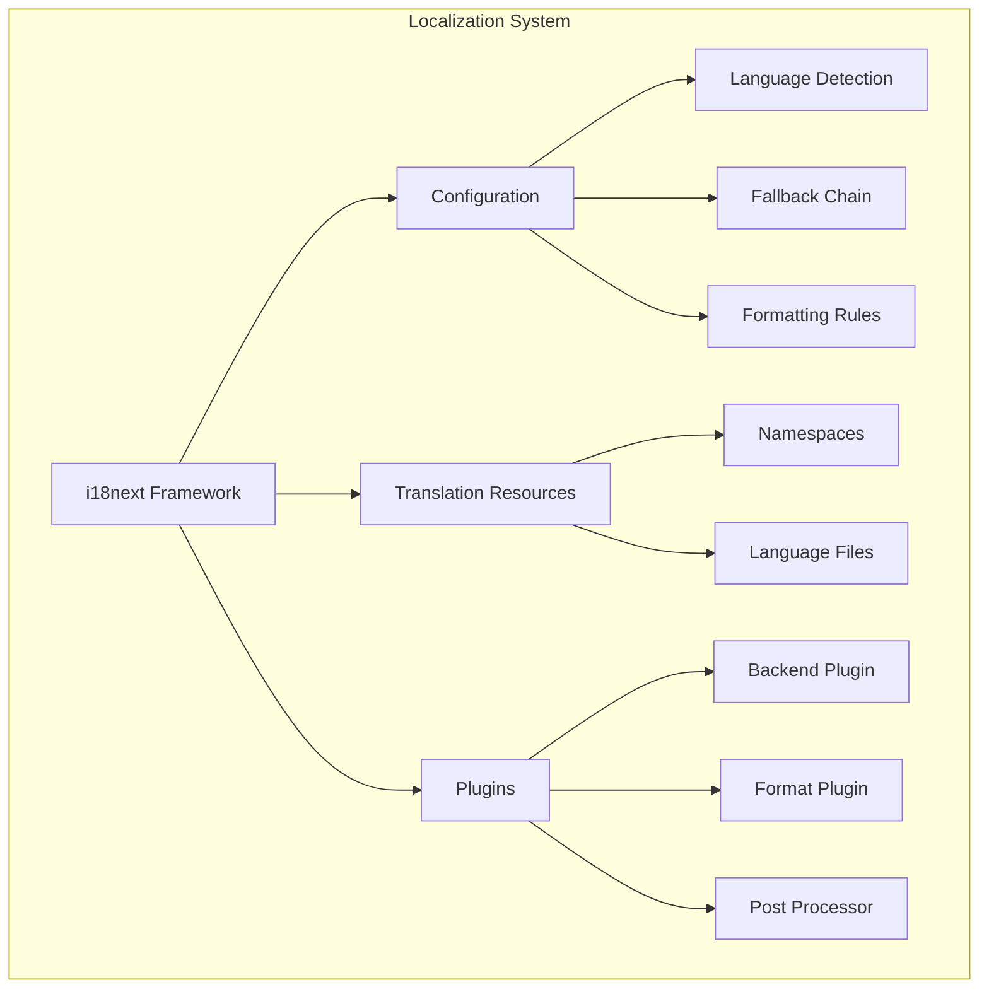
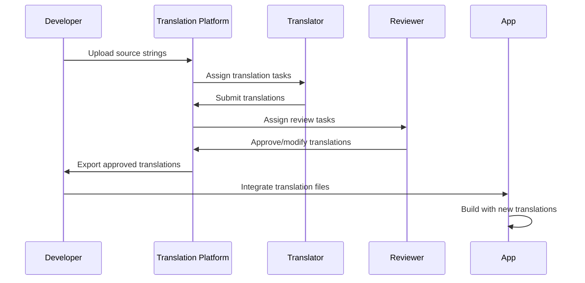
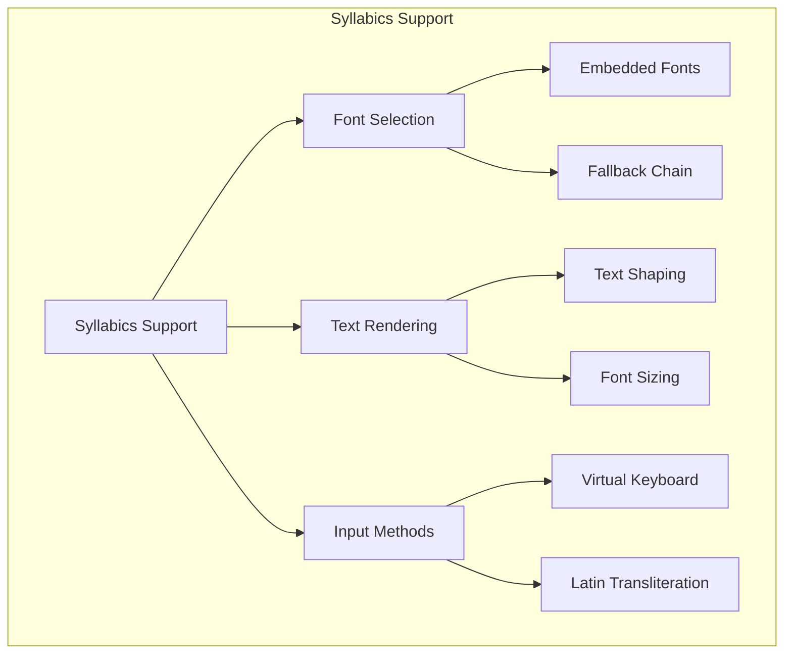
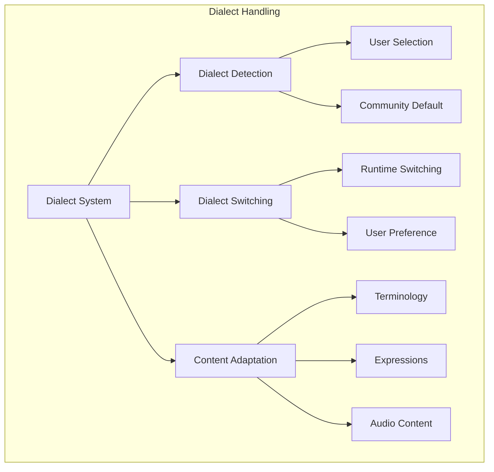
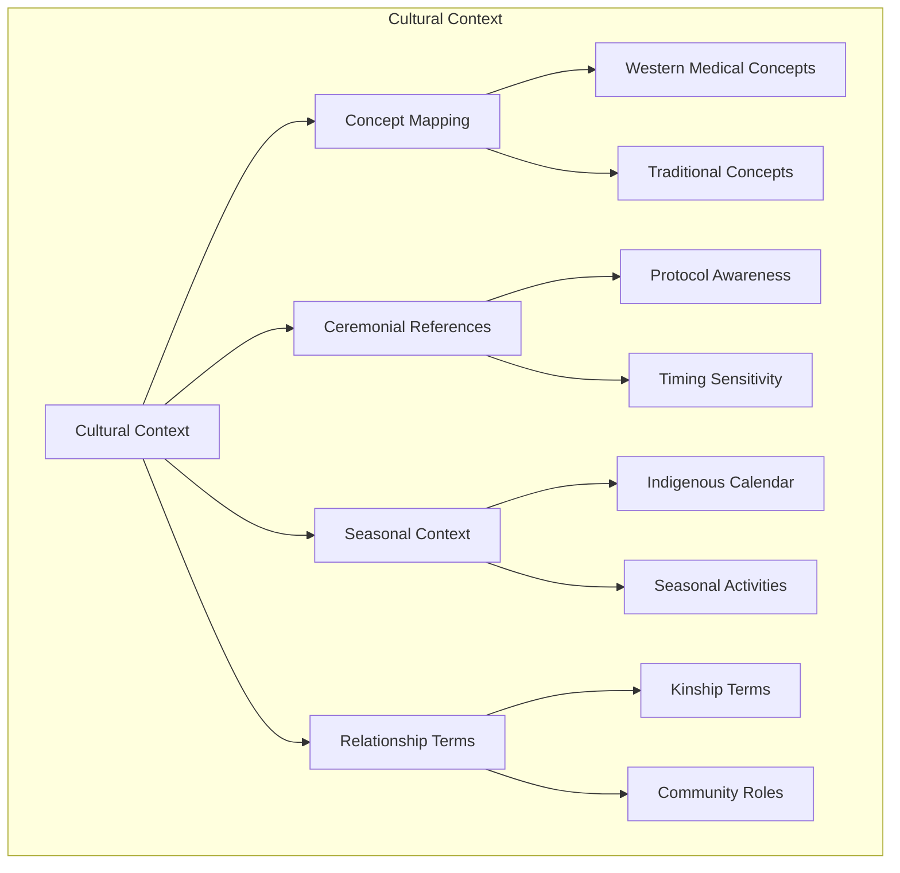
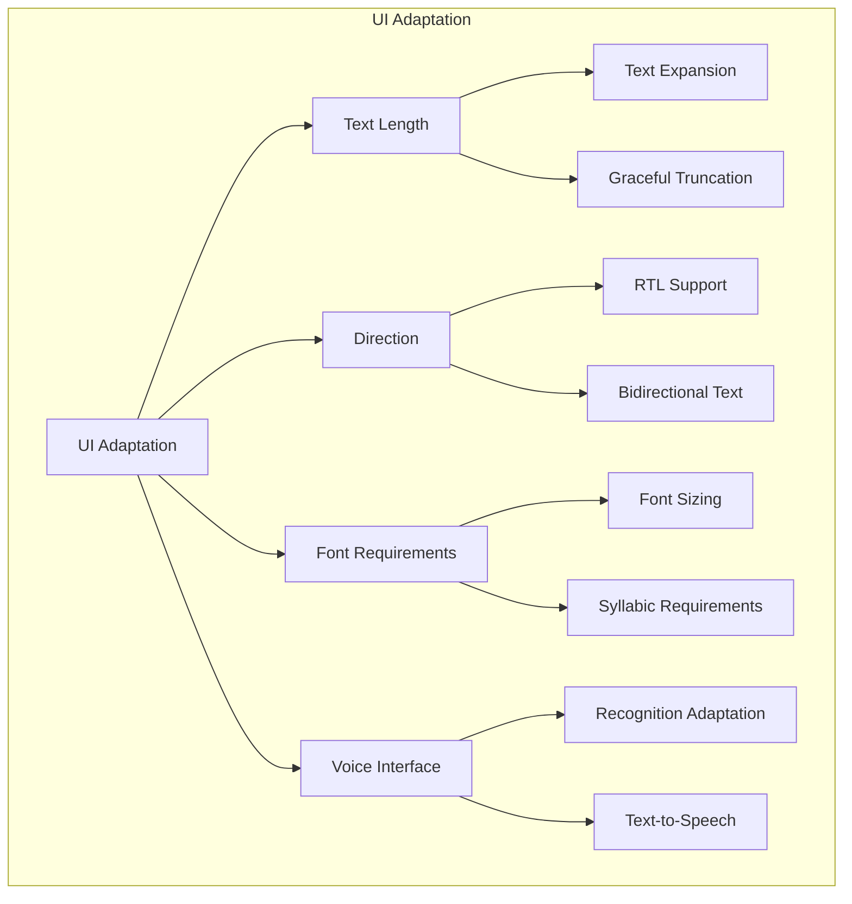
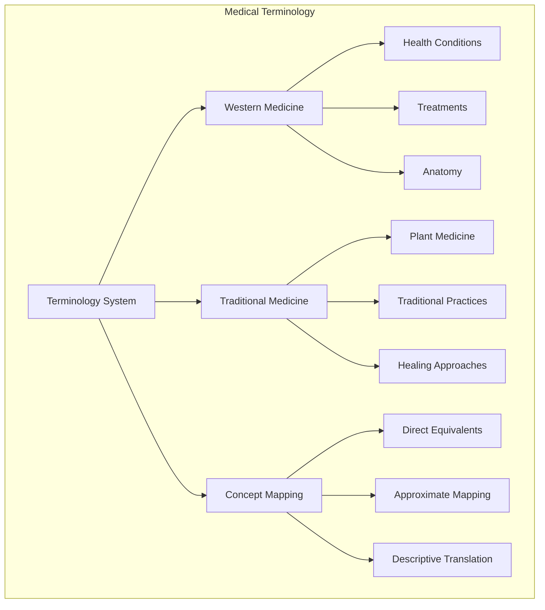
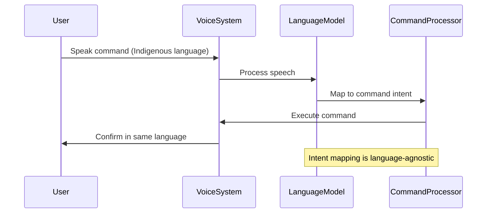
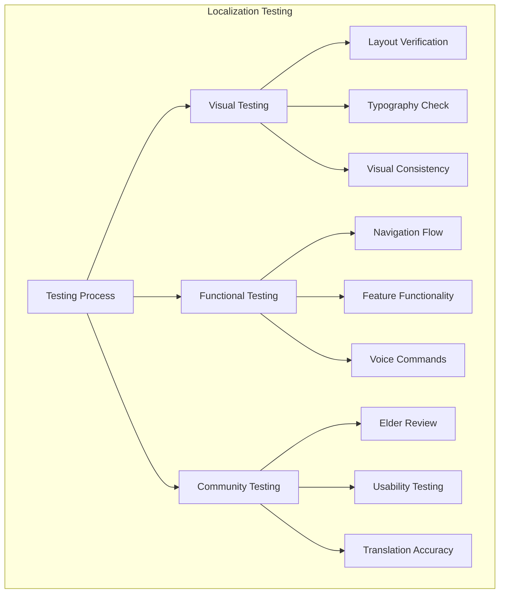
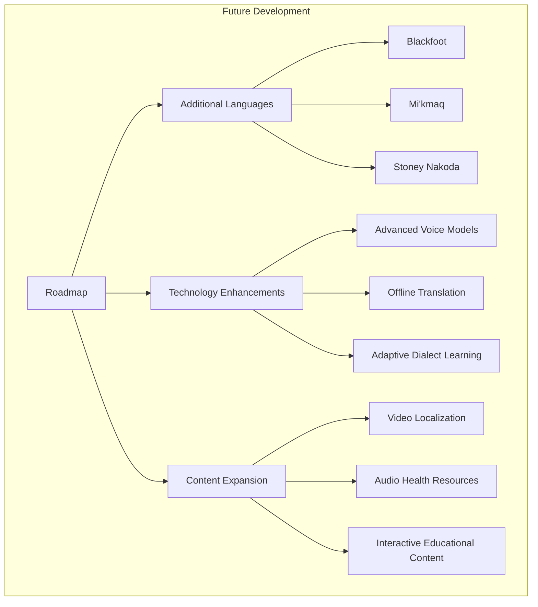

# KweCare Localization Guide

This document provides comprehensive information about KweCare's localization system, which supports multiple Indigenous languages alongside English. It serves as a guide for developers, translators, and content creators working on the application.

## Supported Languages

KweCare currently supports the following languages:

| Language | Code | Type | Direction | Supported Dialects |
|----------|------|------|-----------|-------------------|
| English | `en-CA` | Latin | LTR | Canadian English |
| Plains Cree | `cr-latn` | Latin | LTR | Standard Plains Cree |
| Plains Cree (Syllabics) | `cr-cans` | Syllabic | LTR | Standard Plains Cree |
| Woods Cree | `cr-w` | Latin/Syllabic | LTR | Standard Woods Cree |
| Swampy Cree | `cr-s` | Latin/Syllabic | LTR | Standard Swampy Cree |
| Inuktitut | `iu` | Syllabic | LTR | Multiple regional variants |
| Inuktitut (Latin) | `iu-latn` | Latin | LTR | Standardized transliteration |
| Ojibwe | `oj` | Latin | LTR | Southern, Northwestern |
| Michif | `crg` | Latin | LTR | Standard Michif |
| Denesuline | `chp` | Latin | LTR | Standard Denesuline |

## Localization Architecture



### Technical Implementation

KweCare uses the i18next framework for localization with the following setup:

1. **Core Localization System**
   - i18next for translation management
   - React-i18next for React integration
   - Locale-specific formatting for dates, numbers, and units

2. **Language Detection Strategy**
   - User preference stored in localStorage/IndexedDB
   - Browser language detection as fallback
   - Geolocation-based suggestion for first-time users
   - QR code based community preset option

3. **Translation File Structure**
   - JSON-based translation files
   - Namespace separation for modular loading
   - Context-sensitive translations
   - Pluralization support

## Translation Workflow



### Translation Process

1. **Source String Extraction**
   - Automated extraction from code via i18next parser
   - Manual review of extracted strings for context
   - Addition of translator notes for complex concepts

2. **Translation Management**
   - Collaborative translation platform (Localazy)
   - Version control for translations
   - Context screenshots for UI elements
   - Medical terminology glossary

3. **Quality Assurance**
   - Community translator review
   - Elder validation for cultural appropriateness
   - Technical validation (variable substitution, formatting)
   - Clinical validation for medical terminology

## Special Considerations for Indigenous Languages

### 1. Syllabic Writing Systems



KweCare implements the following for syllabic scripts:

- **Font Implementation**
  - Custom font embedding for consistent rendering
  - Aboriginal Sans as primary syllabic font
  - Appropriate font fallback chains
  - Optimized for mobile display

- **Text Input Methods**
  - Virtual syllabic keyboard
  - Latin-to-syllabic conversion
  - Voice input with syllabic output
  - Predictive text in syllabics

### 2. Dialectal Variations



KweCare's approach to dialectal variations:

- **Dialect Configuration**
  - Primary dialect selection per language
  - Region-specific terminology options
  - Community defaults for deployment settings

- **Content Adaptation**
  - Key health terminology in all major dialects
  - Audio recordings in specific dialects
  - Labeled dialectal alternatives when relevant

### 3. Cultural Context in Translation



The translation process includes:

- **Conceptual Bridge Translation**
  - Western medical concepts explained in culturally relevant terms
  - Traditional health concepts accurately represented
  - Avoidance of direct translation for incompatible concepts

- **Contextual Awareness**
  - Seasonal references appropriate to northern communities
  - Ceremonial and protocol-sensitive terminology
  - Kinship and relationship terminology preservation

## String Management Guidelines

### 1. String Format

```
{
  "key": "Value with {{variable}}",
  "key_plural": "Value with {{count}} items",
  "key_context": "Contextual variation"
}
```

### 2. Placeholders and Variables

| Type | Format | Example | Usage |
|------|--------|---------|-------|
| Simple | `{{variable}}` | `Hello {{name}}` | Basic substitution |
| Counted | `{{count}}` | `{{count}} appointments` | Used with plurals |
| Formatted | `{{variable, format}}` | `{{date, YYYY-MM-DD}}` | With formatting |
| Nested | `$t(key)` | `$t(common.greeting)` | Translation reference |

### 3. Pluralization

KweCare supports complex pluralization rules for languages that require them:

```json
{
  "appointment": "{{count}} appointment",
  "appointment_plural": "{{count}} appointments",
  "appointment_0": "No appointments",
  "appointment_1": "One appointment",
  "appointment_many": "Many appointments"
}
```

Indigenous language pluralization often follows different rules than English, and these are implemented as language-specific pluralization functions.

## UI Adaptation for Language



### UI Considerations

1. **Text Length Management**
   - Indigenous languages often require more space than English
   - Flexible layouts to accommodate text expansion
   - Truncation with ellipsis and tooltips when necessary
   - Scrollable areas for longer content

2. **Typography Considerations**
   - Larger font sizes for syllabics (minimum 16px)
   - Higher line height for diacritics
   - Proper font fallbacks for unsupported characters
   - Consistent font weight across writing systems

3. **Voice Interface Adaptations**
   - Language-specific wake words and commands
   - Dialect-specific recognition models
   - Appropriate response pacing and intonation
   - Cultural protocol in voice interaction

## Medical Terminology Translation

KweCare maintains a comprehensive medical terminology database across all supported languages:



### Translation Approaches

1. **Direct Equivalents**
   - Established Indigenous terms for medical concepts
   - Standardized across dialects where possible
   - Validated by Indigenous health professionals

2. **Approximate Mapping**
   - Closest cultural concept when direct translation unavailable
   - Explanatory context added when needed
   - Consistent across the application

3. **Descriptive Translation**
   - Functional descriptions for concepts without equivalents
   - Developed with community health workers
   - Consistent use of descriptive patterns

### Terminology Database

| English Term | Concept | Plains Cree | Inuktitut | Ojibwe | Notes |
|--------------|---------|-------------|-----------|--------|-------|
| Diabetes | Metabolic disorder | "sōkāwāspinewin" | "aukarnirungnasiarvik" | "sogiipiinendamowin" | Descriptive terms that refer to "sugar disease" |
| Blood pressure | Cardiovascular | "mīkowiyin kaohci-sekpayik" | "aunga tunngata" | "miskwi bangishkogaadeg" | Concept translated as "force of blood" |
| Depression | Mental health | "kaskeyihtamowin" | "qiiqsuungniq" | "gashkendamowin" | Concept varies culturally |

## Voice Command Localization



### Voice Localization Features

1. **Language-Specific Recognition**
   - Dedicated acoustic models for each language
   - Dialect variation training
   - Recognition threshold adjustment by language

2. **Command Intent Mapping**
   - Language-agnostic intent extraction
   - Consistent command structure across languages
   - Synonyms and variations support

3. **Response Generation**
   - Culturally appropriate responses
   - Proper pronunciation in TTS responses
   - Appropriate formality levels

## Testing and Validation



### Testing Methodology

1. **Automated Testing**
   - Missing translation detection
   - Variable placeholder validation
   - Layout overflow detection
   - Accessibility compliance

2. **Manual Testing**
   - Language switching in all contexts
   - Voice recognition accuracy testing
   - UI rendering across devices
   - Cultural appropriateness review

3. **Community Validation**
   - Elder review of terminology and phrasing
   - Indigenous healthcare provider accuracy check
   - Community member usability testing
   - Feedback collection and implementation

## Localization Resources

### Development Tools

- **i18next Ecosystem**
  - i18next core library
  - react-i18next for React integration
  - i18next-http-backend for loading translations
  - i18next-browser-languagedetector for detection

- **Indigenous Language Tools**
  - Aboriginal Sans font for syllabics
  - Syllabic input methods integration
  - Specialized voice recognition models
  - Custom pluralization rules

### Content Creation Resources

- **Style Guides**
  - Language-specific style guides
  - Medical terminology glossaries
  - Cultural reference documentation
  - Visual design guidelines for multilingual content

- **Translation Memory**
  - Centralized translation memory
  - Glossary of approved terms
  - Context screenshots library
  - Previous version translations

## Future Localization Roadmap



### Planned Enhancements

1. **Language Expansion**
   - Addition of Blackfoot, Mi'kmaq, and Stoney Nakoda
   - Enhanced dialect support for existing languages
   - Region-specific terminology variations

2. **Technology Improvements**
   - More sophisticated voice recognition models
   - Enhanced text-to-speech for Indigenous languages
   - On-device translation capabilities
   - Machine learning for dialect adaptation

3. **Content Localization**
   - Expanded health education content
   - Multimedia localization (videos, animations)
   - Interactive tutorials in all languages
   - Culturally specific content modules 