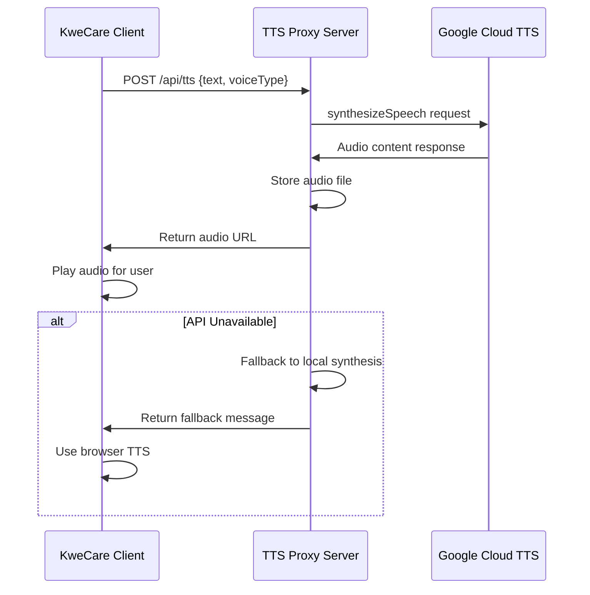

# Google Cloud Text-to-Speech Integration

## Overview

KweCare integrates Google Cloud's Text-to-Speech API to provide high-quality voice synthesis for enhanced accessibility. This feature enables the application to convert text to natural-sounding speech in various languages and voice types, supporting the needs of Indigenous communities with varying language preferences.

## Architecture



## Server Configuration

The TTS integration uses a proxy server pattern to securely communicate with Google Cloud:

1. **Node.js Express Server**: Handles requests from the client application
2. **Google Cloud Authentication**: Uses service account credentials to authenticate
3. **Audio File Management**: Stores generated audio files for client access
4. **Fallback Mechanism**: Gracefully degrades to browser-based TTS if API is unavailable

## Client Implementation

The client application accesses the TTS functionality through:

- React hooks for voice selection and playback
- Audio component for rendering the TTS responses
- Caching mechanisms to reduce redundant API calls

## Voice Options

KweCare supports multiple voice types:

| Voice Type | Google Voice | Gender | Use Case |
|------------|--------------|--------|----------|
| Default    | Neural2-A    | Neutral| General information |
| Female     | Neural2-F    | Female | Patient interactions |
| Male       | Neural2-D    | Male   | Provider information |

## Cultural Considerations

The TTS integration supports Indigenous language pronunciation through:

- Customizable speech parameters
- Support for phonetic adjustments (SSML)
- Future integration with Indigenous language models

## Security Measures

The TTS proxy server implements several security features:

- CORS protection with specific origin restrictions
- API key protection through server-side proxy
- No client-side exposure of Google Cloud credentials
- Audio file cleanup after a set expiration time

## Environment Setup

To configure the TTS functionality, the following environment variables are required:

```
GOOGLE_APPLICATION_CREDENTIALS=/path/to/google-credentials.json
TTS_SERVER_PORT=3002
```

## Fallback Strategy

When Google Cloud TTS is unavailable, the system employs a degradation strategy:

1. First attempt uses Google Cloud TTS API
2. If unsuccessful, server signals client to use browser's built-in Web Speech API
3. Client-side speech synthesis provides basic functionality without external dependencies

## Performance Considerations

- Audio files are cached on the server to reduce repeated API calls
- Client implements a request throttling mechanism to prevent API abuse
- Audio quality vs. file size tradeoffs are configured for optimal performance 